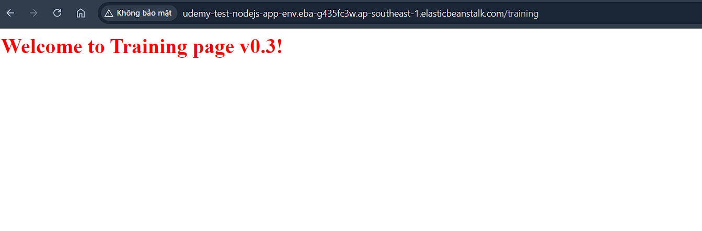

# Giới thiệu Elastic Beanstalk

• Elastic Beanstalk là một dịch vụ của Amazon Web Services (AWS) được sử dụng để triển khai, quản lý và mở rộng web app, web service một cách dễ dàng trên môi trường AWS. Elastic Beanstalk cung cấp một nền tảng quản lý tự động cho việc triển khai ứng dụng và điều chỉnh các tài nguyên cần thiết như Server, Network, Database và các dịch vụ liên quan khác.
• Elastic Beanstalk đóng vai trò như một PaaS nơi bạn tập trung vào việc phát triển ứng dụng còn AWS sẽ phụ trách phần hạ tầng và deployment. Nó hỗ trợ nhiều ngôn ngữ lập trình và framework phổ biến như Java, .NET, PHP, Node.js, Python và Ruby.

• Để triển khai ứng dụng, bạn chỉ cần đóng gói mã nguồn của mình và tải lên Elastic Beanstalk. Dịch vụ sẽ tự động xây dựng và cấu hình môi trường chạy ứng dụng của bạn dựa trên các yêu cầu và tùy chọn. Nó cũng tự động quản lý việc scaling tài nguyên dựa trên tải lượng và yêu cầu của ứng dụng.
• Elastic Beanstalk cung cấp một giao diện quản lý đơn giản và tùy chọn linh hoạt cho phép bạn tùy chỉnh cấu hình và kiểm soát ứng dụng của mình.

# Tính năng của Elastic Beanstalk

(sử dụng console để tạo ra các môi trường sau đó upload code (code có thể đã build hoặc chưa build), EB sử dụng cloud formation là dịch vụ về deployment để tạo ra các ec2 instance kết hợp clouwatch )
• Tự động tạo ra môi trường và các tài nguyên liên quan. (không phải tự setup ALB, VPC, SG)
• Cung cấp khả năng auto scaling
• Monitoring thông qua giao diện thân thiện giúp bạn theo dõi được tình trạng của app cũng như môi trường.
• Hỗ trợ nhiều platform: Java, .NET, Node.js, PHP, Ruby, Python, Go, and Docker.
• Đa dạng hình thức deploy vd Console, CLI, VS Code, Eclipse... Hỗ trợ deployment policies vd rolling, blue-green...
• Tự động update platform version khi cần thiết.

# Ưu điểm của Elastic Beanstalk

1.Dễ sử dụng: Elastic Beanstalk cung cấp một giao diện quản lý đơn giản và tương tác trực quan, giúp bạn triển khai và quản lý ứng dụng một cách dễ dàng mà không cần hiểu rõ về cấu hình và quản lý hạ tầng.
2.Tự động hóa quy trình triển khai, giúp giảm thời gian và công sức cần thiết cho việc triển khai ứng dụng.
3.Quản lý tự động tài nguyên: Elastic Beanstalk tự động quản lý việc mở rộng và thu hẹp tài nguyên dựa trên tải lượng và yêu cầu của ứng dụng.
4.Hỗ trợ nhiều ngôn ngữ và framework: Elastic Beanstalk hỗ trợ nhiều ngôn ngữ lập trình và framework phổ biến như Java, .NET, PHP, Node.js, Pytho và Ruby

Nhược điểm của Elastic Beanstalk
1.Giới hạn tùy chỉnh: Mặc dù Elastic Beanstalk cung cấp các tùy chọn cấu hình và kiểm soát, nhưng nó có thể hạn chế đối với
những ứng dụng phức tạp đòi hỏi sự tùy chỉnh cao hơn. Nếu bạn có nhu cầu tùy chỉnh chi tiết hơn, có thể cần sử dụng các dịch vụ khác của AWS như EC2, ECS, EKS.
2.Giới hạn của mô hình phân phối: Elastic Beanstalk dựa trên mô hình phân phối dựa trên máy ảo EC2, điều này có thể gây ra một số hạn chế trong việc mở rộng và quản lý tài nguyên trong một số tình huống đặc biệt. Đối với các ứng dụng đòi hỏi mô hình phân phối linh hoạt hơn, có thể cần sử dụng service khác.

# Usecase

## Elastic Beanstalk phù hợp với

• Hệ thống có backend đơn giản
• Team muốn đơn giản hoá quy trình deploy hoặc chưa có nhiều kinh nghiệm với AWS.
• Hệ thống monolithic

## Elastic Beanstalk không phù hợp với.

• Hệ thống có backend phức tạp, vd micro service.
• Có nhu cầu customize nhiều

**LƯU Ý** cho các bài lab beanstalk để tránh gặp lỗi.

Mọi người chú ý khi tạo file để upload lên Elastic Beanstalk:

File nodejs phải để tên là "app.js". Nếu thêm version vd app_v1.0.js thì sẽ bị lỗi.

File "app.js" phải được nén thành 1 file zip vd "app.zip" trước khi upload lên.

Chi tiết mời các bạn xem hình ví dụ:

# Lab 1 – Deploy ứng dụng cơ bản.

Yêu cầu deploy một ứng dụng đơn giản code bằng Nodejs lên
Elastic Beanstalk

1. Chuẩn bị source code, chạy thử ở local.
2. Tạo môi trường, upload source code.
   (beanstalk => create application => name: udemy-test-nodejs-app => create)
   (application => environment => teir: Web server environment => environment name: test-environment-01 => Domain: viettu-udemy-eb => platform type: Managed platform => Platform: Nodejs, version 16 => platform version: chọn cái mới nhất => application code: Upload your code => version label: "v0.1" => local file -> upload code zip => Presets: single instance => next => service role: reate new -> name: "udemy-elastic-beantalk-role" -> keypair -> View permission details (copy AWSElasticBeanstalkWebTier => iam => role => create role => type: AWS server => Service or use case: EC2 => next => name: "udemy-elatic-beanstalk-web-role" => create role => add permision => create inline policy => qua tab json => paste AWSElasticBeanstalkWebTier => name: elastic-beanstalk-web-inline-policy => create policy => review: nó cho phép instnace gán cái role này có quyền tương tác s3 buckent elasticbeanstalk bản chất eb lấy code lên sẽ up lên s3 những con ec2 pull code s3 để chạy) -> EC2 instance profile: "udemy-elatic-beanstalk-web-role" => next => vpc: default => public ip: tích Activated (nếu có vấn đề vô ec2 debug) => subnet: chọn tối đa => database: disable => next => Root volume type: General Purpse SSD => Size: 10GB => security groups: default => Auto scaling group -> type: loadblance -> min:2,max:3 => Scaling triggers -> Metric: CPUUtiliztion -> Unit: Percent -> Upper threshold: 70 (70% cpu) -> Lower threshold: 20 (20% cpu) => Load balancer network settings -> Visibility: public -> Dedicated -> Listeners: 80 -> Processes: 5000 (tích 80 -> edit, port instance) => next => Health reporting -> System: Enhanced -> metric: ApplicationRequests5xx (theo dõi nếu reponse trả về status 500) => Log streaming: tích Activated (đẩy log lên cloud watch) => Managed updates (tự đông nâng cấp version vd ta chạy node 16, xog nó ra bản vá node 16 thì nó tự update giúp mình) => Deployment policy: All at one (thay thế toàn bộ instnce khi update version mới => có downtime) => Ignore health check: False (phải check health nếu false thì rollback về version cũ) => Submit )
3. Đợi môi trường ready, truy cập thử.

# Lab 2 – Update version.

Yêu cầu update source code và deploy lại.

1. Chỉnh sửa source code
2. Truy cập môi trường, chọn update version, update code mới.
   (Environments => Udemy-test-nodejs-app-env => Upload and deploy => version: v0.2 (deploy này không tiến hành xóa instance tạo lại, con instance tự pull code mới về và run lại))
3. Confirm code mới đã được deploy thành công.
   

# Lab 3 – Blue/Green deployment

Yêu cầu deploy version mới sử dụng blue-green

1. Tạo thêm một environment
   (elastic beanstalk => enviroment => test-environment-01 => Ation => Clone envirmoent => name: test-environment-02 => domain: viettu-udemy-eb-02 => Clone: "aws-elasticbeanstalk-service-role" )
2. Deploy code mới lên environment mới. (test-environment-02)
3. Test environment mới
   
4. Switch traffic giữa 2 môi trường.
   (elastic beanstalk => enviroment => test-environment-02 (bấm vô trong) => Action => Swap environment domain => Environment: test-environment-01 => swap ) => khi swap xong thì 2 domain sẽ cháo đổi cho nhau, tức env-1 bây gời trỏ tới taget của env-2, và ngược lại
   
5. Terminate môi trường cũ.
   
   
