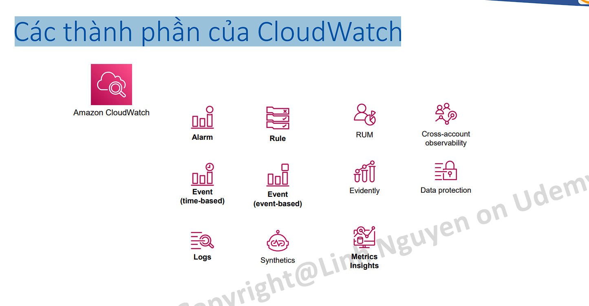
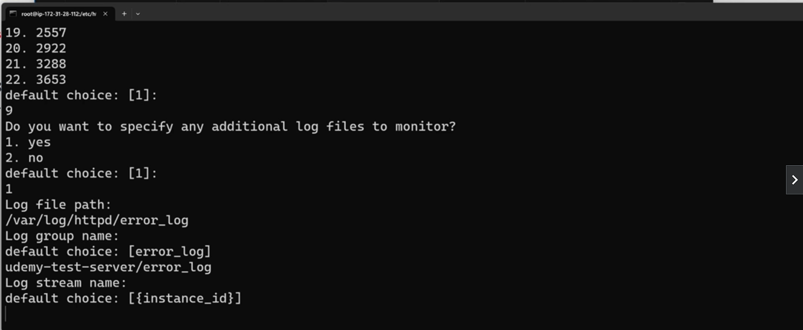
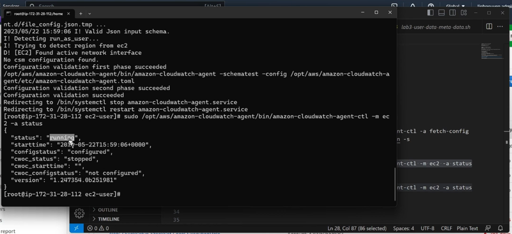
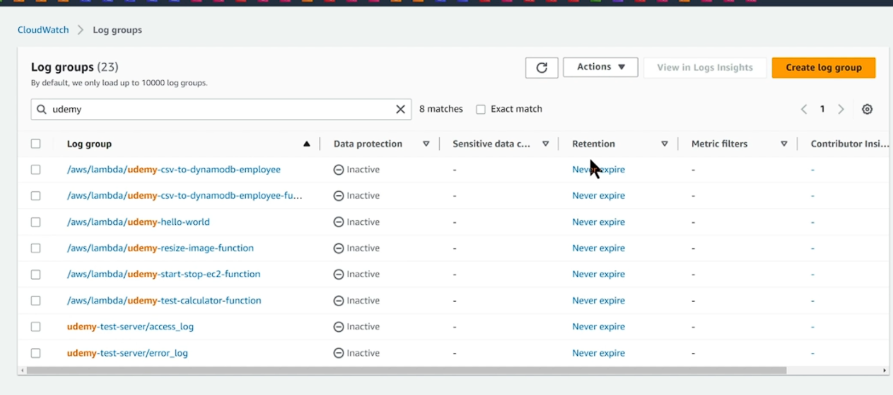
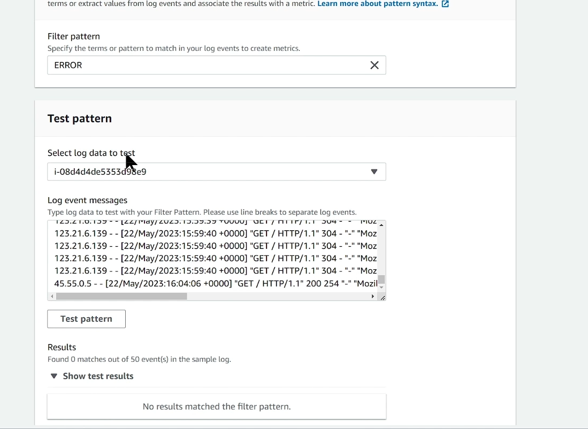
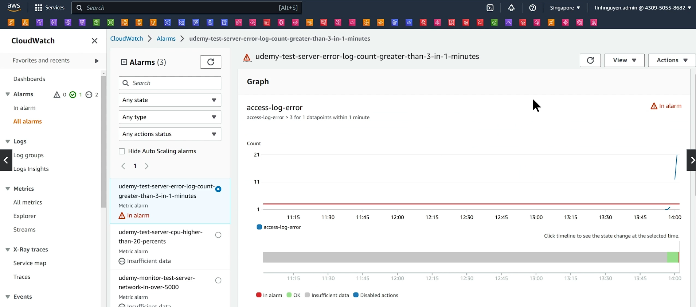

# Tại sao cần monitor (giám sát) hệ thống?

• Hệ thống được thiết kế và xây dựng tốt đến đâu thì vẫn sẽ tiềm ẩn các nguy cơ gặp sự cố, nhiệm vụ của giám sát (monitor) là theo dõi sức khoẻ của hệ thống, phát hiện những vấn đề kịp thời, từ đó đưa ra các hành động hợp lý như thông báo cho quản trị viên hoặc recovery action.
• Nhu cầu truy cập, workload của các resource sẽ biến động không ngừng theo thời gian, cần có cơ chế giám sát để có hành động kịp thời, tránh các sự cố (không đủ tài nguyên, workload quá cao giảm trải nghiệm người dùng...)
• Việc giám sát liên tục trạng thái của các resource cũng là tiền đề để hệ thống có thể auto-scale.

# CloudWatch là gì?

• AWS CloudWatch là một dịch vụ được thiết kế để giám sát và quản lý hệ thống và ứng dụng trên nền tảng AWS. Nó cung cấp khả năng thu thập, xử lý và hiển thị các thông tin liên quan đến hiệu suất, khả năng mở rộng và lỗi của các tài nguyên trong môi trường AWS.
• CloudWatch cho phép bạn theo dõi các thông số quan trọng như CPU usage, network traffic, storage, database. Nó cũng cung cấp các dịch vụ ghi log để lưu trữ và phân tích các sự kiện quan trọng từ các ứng dụng và hệ thống. Bạn có thể sử dụng CloudWatch để tạo ra các đồ thị và báo cáo để theo dõi hiệu suất và tình trạng của các ứng dụng và hệ thống trên AWS.
• CloudWatch cũng hỗ trợ các cảnh báo tự động (Alarm) dựa trên ngưỡng mà bạn đặt để thông báo khi các tài nguyên vượt quá giới hạn hoặc xảy ra lỗi. Điều này cho phép bạn tự động phản ứng kịp thời và giải quyết các vấn đề trong hệ thống của mình.

# Hệ sinh thái CloudWatch


# CloudWatch overview


# Các thành phần của CloudWatch



# CloudWatch Metrics

- Metrics là các thông số đo lường được thu thập và lưu trữ bởi CloudWatch. Chúng đại diện cho các giá trị số hoặc các điểm dữ liệu liên quan đến hoạt động của các tài nguyên trong môi trường AWS, VD EC2, RDS, Elastic Load Balancer, hoặc các dịch vụ tạo ra bởi người dùng.
- Metrics hiểu cơ bản là một tập hợp time-series data.
- Có 2 loại metrics là default metrics (do AWS thu thập) và custom metrics (do người dùng tự định nghĩa).
- Metrics được dùng để làm input cho Alarm hoặc hiển thị trên graph của dashboard phục vụ mục đích giám sát

- CloudWatch Metrics có quy định về thời gian lưu trữ cho metrics, cụ thể như sau:
  • 1 second metrics are available for 3 hours.
  • 60 second metrics are available for 15 days.
  • 5 minute metrics are available for 63 days.
  • 1 hour metrics are available for 455 days (15 months).
- Điều này đồng nghĩa với việc những khoảng thời gian càng lâu sẽ càng ít detail hơn (độ dày của data point ít hơn).

# CloudWatch Metrics – Custom metrics

- Một số thông số trên EC2 instance mặc định không thể được thu thập bởi AWS, cần phải cài đặt agent lên để thu thập và gửi metrics lên CloudWatch. VD về agent: CloudWatch Agent, Prometheus, Data dog agent, Telegraf, StatsD.
- Các metrics có thể được tính toán để tạo ra một metrics khác phục vụ nhu cầu autoscaling, alarm.
- VD: (số lượng instance) / (số lượng message trên SQS).

# CloudWatch Alarm

```
• CloudWatch Alarm cho phép bạn tạo ra cảnh báo tự động dựa trên các giá trị Metrics. Khi một CloudWatch Alarm được định cấu hình, nó kiểm tra liên tục các giá trị Metrics và kích hoạt cảnh báo nếu các giá trị vượt quá hoặc thỏa mãn các ngưỡng xác định.
• Khi một CloudWatch Alarm được kích hoạt, nó có thể thực hiện các hành động xác định trước, bao gồm:
    o Gửi thông báo qua email (kết hợp với SNS, SES)
    o Gửi thông báo qua tin nhắn văn bản (SMS) khi kết hợp với SNS
    o Kích hoạt các hành động tự động: CloudWatch Alarm có thể kích hoạt các hành động tự động, chẳng hạn như restart EC2, adjust storage, hoặc call API đến các dịch vụ khác trong AWS.
    o Các CloudWatch Alarm có thể được tạo ra dựa trên nhiều điều kiện khác nhau, bao gồm giá trị Metrics vượt ngưỡng, giá trị Metrics thấp hơn ngưỡng, trung bình hay tổng hợp các giá trị Metrics trong một khoảng thời gian nhất định, và nhiều điều kiện khác nữa.
```

# CloudWatch Log

```
• CloudWatch Logs là một dịch vụ cho phép bạn lưu trữ, xem và phân tích các logs từ các ứng dụng và hệ thống trong môi trường AWS cũng như on-premise.
• Nhiều service của AWS có optinion cho export thẳng log ra CloudWatch, chỉ cần enable lên là có thể xem được.
• CloudWatch Log hỗ trợ các thao tác:
    o Xem các logs theo thời gian thực trong giao diện CloudWatch Logs hoặc sử dụng API để truy xuất logs.
    o Lọc và Tìm kiếm Logs: CloudWatch Logs cung cấp công cụ để lọc và tìm kiếm logs theo các điều kiện xác định. Bạn có thể tìm kiếm các mẫu, từ khóa hoặc các thuộc tính đặc biệt trong logs để tìm kiếm và phân tích thông tin cần thiết.
    o Lưu trữ Logs: CloudWatch Logs cho phép bạn lưu trữ logs trong một kho lưu trữ lâu dài để duy trì lịch sử và thực hiện các phân tích sau này.
    o Phân tích Logs: Bạn có thể sử dụng các dịch vụ và công cụ khác của AWS như Amazon Athena, Amazon Elasticsearch hoặc các công cụ khác để phân tích logs từ CloudWatch Logs và trích xuất thông tin hữu ích.
```

# CloudWatch Log - Concepts

• Log Group: Level cao nhất của CloudWatch Log. Thông thường mỗi nhóm service hoặc resource sẽ push log ra một log group cụ thể.
• Log Stream: Đơn vị nhỏ hơn trong log group.
• Log Metrics Filter: Định nghĩa các pattern của log để thống kê. Khi log message được set filter, đồng thời bạn cũng tạo ra một metrics trên log group đó.
• Log retention: Thời gian log tồn tại trên CloudWatch, được set riêng cho từng log group.
• Log streaming and archive: Bạn có thể export log ra các service như S3 nhằm mục đích lưu trữ lâu dài với giá rẻ hoặc stream sang Kinesis phục vụ mục đích realtime analytic.

# CloudWatch Log Insight

- Một công cụ cho phép bạn truy vấn log thông qua một cú pháp do AWS định nghĩa.


- Cung cấp công cụ hỗ trợ đơn giản hoá việc collect metrics và log một cách chi tiết.
- Áp dụng cho ứng dụng chạy trên Container và Lambda.

- Ví dụ về monitor Lambda có enable Insight
  

# X-ray

Cung cấp cái nhìn toàn cảnh và chi tiết đường đi của request trong application, giúp điều tra, visualize dựa theo function, api, service.

- Collect traces: traces ở đây là req từ lúc bắt đầu đến Amazone rồi reponse về cho người dùng
- Record traces: view các traces trên service map, bao nhiều thành phần tham gia request này, nó đi qua api gateway như thế nào
  

Ví dụ về tracing đối với API Gateway + lambda


# CloudWatch Dashboard

- CloudWatch Dashboard cho phép bạn theo dõi nhiều resource (cross regions) trên một view duy nhất.
- Bạn có thể add nhiều biểu đồ (widget) với nhiều hình dạng, customize size, màu sắc, title, đơn vị, vị trí...
- Widget có thể là biểu đồ, con số biểu diễn một metrics của một resource hoặcdanh sách log từ một log group.

# CloudWatch Dashboard - Example


# Khi thiết kế monitor cần quan tâm những gì?

- Đặt câu hỏi và trả lời các mục sau:
  • Hệ thống có những resource nào cần monitor?
  • Với mỗi resource cần monitor những thông số nào?
  • Những thông số nào cần set alarm? thông số nào cần visualize (dashboard)?
  • Những resource nào cần collect log?
  • Với mỗi resource có log, collect những loại log nào?
  • Có set alarm cho log không?
  • Metrics và Log lưu trữ ở đâu? (Native service or tự dựng?)
  • Khi có alarm cần thông báo tới ai?
  • Những yêu cầu khác liên quan quy trình vận hành...

# Lab 1 – CloudWatch Alarm

Yêu cầu tạo một alarm dành cho EC2 có notification sang email, giả lập usage cao
(VD CPU, Network) và tiến hành test alarm.

1. Tạo một EC2 server, sử dụng script để cài httpd, test truy cập thành công.
   (EC2 => name: "udemy-test-monitor-server" => chọn keypair => User data: dán user-data.sh vô => launch instance)
2. Tạo một alarm cho Network In, thresthold 2000, notify đến email.
   (CloudWatch => Alarm => All alarm => create alarm => select metric => Metric: EC2 => Per-instance Metric => copy instance id rồi dán vô => chọn Netwrokin => select metric => next => Priod: 1 minute => Thresod type: Static => Grater => than: 5000 => data point: 1 out of 1 (1 trên 1 gặp 1 lần thì alarm liền, 2 trên 3 nó đánh giá 3 lần trong 3 lần đó 2 lần gặp trạng thái lớn hơn 5000 thì alarm) => next => Alarm state trigger: In alarm => Create new topic => create a new topic: "udemy-cloudwatch-alarm-test" => email endpoint: ll6012065@gmail.com -> Create topic => System Manager action (dịch vụ giúp tự động hóa ví dụ: viết script trên con server là dọn dẹp log khi ổ cứng đầy, ta có thể dùng System manager để trigger hành dộng dọn dẹp đó) => next => alarm name: "udemy-monitor-test-server-network-in-over-5000" => next => create alarm) => vô mail confirm sns topic
   
   
   
3. Tạo một alarm cho CPU Usage, threshold 20%, notify đến email.
   (CloudWatch => Alarm => All alarm => create alarm => select metric => Metric: EC2 => Per-instance Metric => copy instance id rồi dán vô => chọn CPUUtilzation => select metric => Period: 1 minute => than 20 => next => topic: chọn cái topic vừa tạo =>next => alarm name: "udemy-test-server-cpu-higher-than-20-percent => next => create alarm )
   
4. Truy cập liên tục website, confirm alarm Network gửi đến email.
   (F5 liên tục website)
   Có cảnh báo: 
   
5. Giả lập CPU usage cao, confirm alarm CPU gửi đến email.
   (ssh vô ec2 => apt install )

```bash
#Alarm name:
udemy-monitor-test-server-network-in-over-5000
udemy-test-server-cpu-higher-than-20-percents

#Install tool to stress test
sudo amazon-linux-extras install epel -y
sudo yum install stress -y

#Start test
sudo stress --cpu 2 --timeout 180
```


Kiểm tra: 


# CloudWatch Alarm

Một số chú ý cho CW Alarm trong quá trình thiết kế và setting
• Naming rule: dễ đọc, dễ hiểu, nhìn vô biết ngay là hệ thống nào, môi trường nào, resource nào, vấn đề gì.
Tham khảo naming rule: <system-name>-<env>-<resource>-<alarm>
VD: ABCBank-dev-master_database-CPU-is-higher-80%-in-10-mins
• Threshold phải hợp lý. Điều này phải được kiểm chứng thông qua quá trình performance test và turning, rất khó để setting kiểu “một phát ăn ngay”.
• Phân chia notification target cho những nhóm resource và người phụ trách phù hợp. Có thể tách mỗi nhóm resource thành 1 topic SNS.
• Xác nhận với khách hàng/người thiết kế về những thông số cần collect/set alarm từ giai đoạn sớm của dự án.

# Lab 2 – CloudWatch Agent

Yêu cầu: Tạo một EC2 instance, thực hiện cài đặt CWAgent lên trên đó, cấu hình CWAgent đẩy các thông số như Memory, Disk, Log lên CloudWatch.

1. Tạo một EC2 instance với AMI Amazon linux 2 2023, cài httpd, test truy cập.
2. Cấp IAM Role phù hợp cho EC2 Instance (CloudWatchAgentServerPolicy)
   (IAM => create role => Use case: EC2 => Permission policies: CloudWatchAgentServerPolicy => role name: "udemy-test-cloud-watch-role" => create role)
   (EC2 => Action => Security => Modify IAM role => chonj role vuawf taoj => update IAM role)
3. Cài đặt CloudWatch Agent
   (file la2-install-cw-agent.txt)

```bash
###### Install cloudwatch Agent #####
#Install
sudo yum install amazon-cloudwatch-agent

#Run the wizard
sudo /opt/aws/amazon-cloudwatch-agent/bin/amazon-cloudwatch-agent-config-wizard
```


Log stream name: enter thoi 





```bash
#Check config file created by Wizard
cat /opt/aws/amazon-cloudwatch-agent/bin/config.json

#Fetch config file
sudo /opt/aws/amazon-cloudwatch-agent/bin/amazon-cloudwatch-agent-ctl -a fetch-config -m ec2 -c file://opt/aws/amazon-cloudwatch-agent/bin/config.json -s
```


```bash
#Check status of CW Agent
sudo /opt/aws/amazon-cloudwatch-agent/bin/amazon-cloudwatch-agent-ctl -m ec2 -a status

```



Kiểm tra log group ==> kiểm tra xem log có được collect ở log group không


4. Cấu hình CloudWatch Agent (collect access log của httpd, Memory, Disk usage)
5. Enable service CW Agent khởi động cùng OS và theo dõi log của CW Agent xem hoạt động thành công.
6. Thử access website, confirm log được gửi lên CW Log?
7. Xem metrics có được gửi lên CloudWatch metrics thành công?
   (CloudWatch => All metrics => Metric: CWAgent => CWAgent: paste id của instance vô => chọn CWAgent-instanceId)
   
   
   
   
   

==> dùng các thông số này để tạo alarm

==> Cài CW Agent để lấy 2 thông số là memory usage, disk usage, thì 2 thông số này nếu không có

==> Cấu hình lấy ra 2 access_log và error_log


# Lab 3 – Log Metrics filters

Yêu cầu: Metrics filter trên log group “access_log”, setting alarm nếu xuất hiện ERROR log trên 3 lần trong 1 phút thì thông báo notification.

1. Tạo một Log Metrics filter trên log group “access_log” với keyword là “ERROR”.
   (CW => Log groups => udemy-test-server/access_log => Metric filters => create metric filter => Filter pattern: "ERROR" => Test pattern: chọn instance Id => Test pattern (thì không thấy match gì hết vì access_log này không có ERROR) => next => Filter name: "access-log-error-filter" => metric namespace: "udemy-test-server" (gs con server này có nhiều log group và có thể để cùng 1 namespace cho dễ quản lý) => metric name: "access-log-error" => metric value: 1 (mỗi lần error xuất hiện cộng lên 1 đv) => Default value: không điền gì => Unit: Count => next => Create metric filter ) => Với metric filter đồng thời nó cũng sinh ra một metric ở trên CW
   
   
   
2. Tạo một Alarm dựa trên Metrics filter vừa tạo.
   • Theshold: 3
   • Duration: 1 min
   • Statistic: Sum
   (Chọn vô Metric fiter vừa tạo => Create alarm => Period: 1 minute => type: Static => Greater => than: 3 => Missing data treatement: Treat mising data as good (không có messange lỗi thì tốt) => next => Select an exting SNS topic => chọn topic: udemy-cloudwatch-alarm-test => next => alarm name: "udemy-test-server-error-log-count-greater-than-3-in-1-minutes" => next => create alarm)
   
   
3. Thử ghi log dummy có keyword ERROR vào trong “access_log” file.
   (ssh vô EC2 )

```bash
#Write dummy log to log file
echo 'this is test ERROR log' >> /var/log/httpd/access_log
```


4. Confirm alarm được kích hoạt và gửi email.

Vô log group => access_log => kiểm tra log xem có ERROR không => có nhiều messange ERROR log


Sau một phút thì sẽ thấy Cảnh báo Alarm

Check mail


==> Muốn setting alarm cho log thì ta phải đặt metric filter trên Log group đó và metric filter khi đã filter rồi thì thành một metric thông thường và có thể monitor nó

Lab 4 – CloudWatch Dashboard

- Yêu cầu: Tạo một dashboard trên CloudWatch, add một vài widget vào dashboard.
  • CPU
  • Memory (custom metrics)
  • Disk usage (custom metrics)
  • Log (lấy từ CloudWatch agent gửi lên)


Yêu cầu đã làm bài Lab2, cài đặt CW Agent trên EC2 thành công.
Steps:

1. Truy cập vào CloudWatch, Dashboard, tạo một Dashboard mới.
   (CW => dashbaord => Create dashboard => name: "udemy-test-ec2-dashboard" => type: Line => next => Metrics => next => Metric: EC2 => chọn Per-instance-metrics => dán id instance vô => chọn CPUUtilization => Create widget )
   
   
   
   
2. Add CPU Usage widget
3. Add Memory Usage widget
   (Bấm dấu cộng => type: Line => next => metrics => CWAgent => InstanceId => chọn mem_used-precent => create widget )
   
   
4. Add Disk Usage widget
   (Bấm cộng => type: Number => Metrics => CWAgent => InstanceId => chọn disk_used-percent => Create widget )
   
5. Add Log message widget
   (Bấm cộng => type: Logs table => select log group: chọn udemy-test-server/access_log => Create widget )
   
   

(Bấm cộng => type: Logs table => select log group: chọn udemy-test-server/error_log => Create widget )


6. Lưu Dashboard lại.

# CloudWatch pricing

CloudWatch tính tiền dựa trên các yếu tố:
• Số lượng metrics: $0.3/metrics/month
• Số lượng Alarm: $0.1/alarm/month
\*Metrics và Alarm sẽ bị tính phí cao hơn nếu sd high resolution.
• Số lượng Dashboard: $3/dashboard/month
• Số lượng event push lên CloudWatch
• Dung lượng log lưu trữ trên CloudWatch: $0.7/GB
• Dung lượng log scan khi sd CloudWatch Log Insight
• and more...
Chi tiết hơn có tại: https://aws.amazon.com/cloudwatch/pricing/

# CloudTrail

- CloudTrail là một dịch vụ quản lý và giám sát log (log) hoạt động của resource trong môi trường AWS. CloudTrail ghi lại và theo dõi các hoạt động của người dùng, tài khoản, dịch vụ và tài nguyên trong tài khoản AWS của bạn. Dịch vụ này giúp bạn hiểu rõ hơn về những gì đã xảy ra trong tài khoản AWS của bạn, bảo mật hơn và giúp tuân thủ security compliance.
- Khác với CloudWatch có mục đích giám sát tình trạng của resource, CloudTrail có mục đích ghi lại những hành động đã được thực thi trong môi trường AWS (who did what?).

# Các chức năng cơ bản của CloudTrail

Một số chức năng và lợi ích của AWS CloudTrail bao gồm:
1.Ghi lại các sự kiện quan trọng: CloudTrail ghi lại các sự kiện như việc create, update, delete resource, truy cập vào resource, tạo, sửa đổi hoặc xóa IAM roles, và các hoạt động khác liên quan đến tài nguyên AWS.
2.Giám sát và kiểm tra tuân thủ: CloudTrail cung cấp thông tin chi tiết về các hoạt động trong tài khoản AWS, giúp bạn kiểm tra và đảm bảo tuân thủ các quy định, chính sách và quy trình an ninh nội bộ. 3. Phân tích và bảo mật: Dữ liệu log của CloudTrail có thể được sử dụng để phân tích hoạt động, phát hiện sự cố bảo mật, theo dõi và phản ứng kịp thời đối với các sự kiện không mong muốn hoặc đe dọa bảo mật. 4. Tương thích với các dịch vụ khác: CloudTrail tích hợp với các dịch vụ AWS khác như IAM, AWS Config và Amazon CloudWatch, tạo ra khả năng theo dõi và quản lý toàn diện. 5. CloudTrail cung cấp các log record được lưu trữ trong S3 của AWS, nơi bạn có thể truy cập và phân tích dữ liệu log theo nhu cầu.

# Giới thiệu Cloud Trail trên console.
