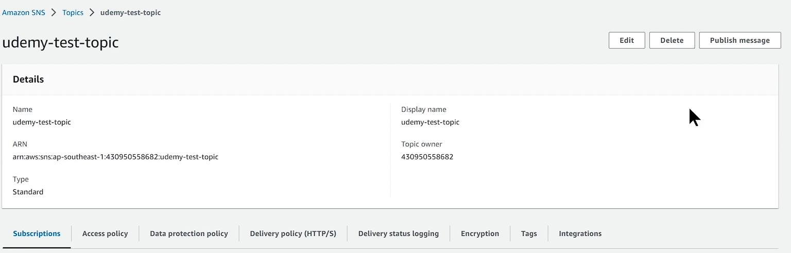

# Simple Queue Service - SQS

```
- Simple Queue Service (SQS) là một dịch vụ hàng đợi thông điệp mạnh mẽ và dễ sử dụng từ AWS. SQS cho phép bạn truyền tin nhắn giữa các thành phần của hệ thống phân tán một cách đáng tin cậy và có khả năng mở rộng.
• Với SQS, bạn có thể tạo ra các message queue và gửi/nhận message trên queue đó. Hàng đợi được quản lý bởi SQS, đảm bảo tính đáng tin cậy và khả năng mở rộng cao. Việc các ứng dụng khác nhau có gửi nhận message trên queue một cách độc lập giúp tăng tính chịu lỗi và sự phân tán trong hệ thống của bạn (de-coupling).
(giả sử ta có 2 nhiệm vụ A và B, nó có sự liên kết ví dụ A chạy xong thì gọi sang B xử lý, nhưng workload của 2 tác vụ không đồng bộ, đôi khi B xử lý chậm hơn mà A xử lý nhanh hơn thì gây ra hiện tượng ...)
• SQS cung cấp hai loại queue: standard & FIFO (First-In-First-Out). Standard queue cung cấp khả năng mở rộng cao và đáng tin cậy, trong khi FIFO queue đảm bảo tin nhắn được xử lý theo tuần tự (nhược điểm là bị giới hạn về tần suất gửi nhận).
• SQS cũng cung cấp các tính năng như chế độ retry tự động, message filtering và khả năng xác nhận (acknowledge) tin nhắn. Ngoài ra, SQS tích hợp với các dịch vụ AWS khác, cho phép bạn xây dựng các hệ thống phức tạp và đáng tin cậy.
```

# Đặc trưng của SQS

• SQS là một managed service do đó bạn không quản lý hạ tầng phía sau.
• SQS được tạo và quản lý dưới các đơn vị message queue.
• Tương tác gửi nhận message với queue thông qua Console, SDK, API
• Khả năng mở rộng của SQS là không giới hạn (về lý thuyết).
• Về cơ bản message nào được gửi vào queue trước sẽ được xử lý trước (khi có hành động get message). Tuy nhiên với Queue type standard, AWS không đảm bảo 100%.
• Với FIFO Queue, SQS đảm bảo deliver đúng thứ tự tuy nhiên tần suất gửi nhận message bị giảm xuống 300/s và 3000/s đối với batch process.
• SQS có thể được cấu hình notify message sang Lambda mỗi khi có mesage mới, sử dụng cho bài toán xử lý tự động hoặc ETL.

# SQS Concepts


- Về cơ bản SQS là nơi có nhiệm vụ trung chuyển giữa một bên là Message Producer (Sender) và một bên là Message Consumer(Receiver).
- Với Standard Queue, message khi được gửi vào queue sẽ tồn tại ở đó cho tới khi bị xoá hoặc hết thời gian retention. Do vậy Consumer phải chủ động xoá message đã xử lý xong.
- Với FIFO Queue, message sẽ được delivery chính xác 1 lần tới consumer (tự động bị xoá sau khi có event receive message).

# SQS Concepts

- SQS có một thông số gọi là Visibility Timeout, là thời gian message tạm bị ẩn đi đối với các consumer trong khi message đó đang được receive bởi một consumer. Quá thời gian này nếu message chưa bị xoá sẽ quay trở lại queue.
  (Giả sử ta có một hệ thống bao gồm 1 producer, 1 queue, nhiều consumer, giả sử consumer get message A và consumer 1 này mất khoảng 10 phút để xử lý video này, trong thời gian đó nếu ta sẽ Visibility timeout là 10s, consumer 2 đi get message về, do consumer 1 xử lý chưa xong thì consumer 2 get trúng messange đó và xử lý tiếp có thể consumer 3 nữa => gây lãng phí resource, tại sao consumer thứ nhất đang xử lý thì consumer 2 không lấy video B đi hoặc consumer 3 lấy video C ==> Apply Visibility timeout)
  
  **Ví dụ** về việc KHÔNG apply visibility timed out (hoặc timed out quá ngắn) trong trường hợp có nhiều consumer. Các consumer có thể get message đang được xử lý bởi một consumer khác (chưa finished).

# SQS Concepts

- Việc apply Visibility Timeout như thế nào cho phù hợp hoàn toàn phụ thuộc vào nghiệp vụ của bạn. VD một tác vụ xử lý decode một video mất 10 mins thì bạn nên để Visibility Timeout >10 phút để tránh tình trạng xung đột xử lý giữa các consumers.
  
  **Ví dụ** về việc CÓ apply visibility timed out trong trường hợp có nhiều consumer. Message đang được xử lý bởi một consumer sẽ tạm thời được ẩn đi đối với các consumer khác.

# SQS Concepts

- Message mỗi khi được receive sẽ có một thông số receive count (được cộng lên +1 mỗi khi message đó được receive bởi một consumer), ta có thể dựa vào đó để setting dead letter queue (tự động move message đã bị xử lý quá số lần mà vẫn chưa thành công).
- Ví dụ: hình dưới ta có 2 queue, apply dead-letter queue với receive count = 5, khi tới ngưỡng giới hạn mà message vẫn chưa được xử lý thành công và xoá khỏi queue, ta sẽ move sang một queue khác (dead-letter queue) để xử lý sau.


# SQS Concepts

- Long polling wait time: thời gian để SQS chờ trước khi return empty cho consumer trong trường hợp không có message nào trên queue.

- flow khi wait time = 0s
  

- flow khi wait time = 10s
  

# Lab 1 – SQS thao tác cơ bản

1. Login vào AWS Console, navigate tới dịch vụ SQS
2. Tạo một queue với các thông số cơ bản.
   (SQS => create queue => type: Standard => name: udemy-test-standard-queue => Visibility timeout 10 Seconds(thời gian message bị ẩn đi tạm thời) => Mesage retetion: 4 days (quá thời gian message sẽ bị tự động delete) => Delivery delay: 0 Seconds (Có message vô gửi ngay tới backend cho tôi) (chờ 1 thời gian nó sẽ lém sang target có thể là lamda, Ec2) => Message size: 256(tối đa 256kb) => Recieve message wait time: 5 Second (Long polling wait time) => Encryption: default => Access policy: default (SQS, S3 là một resource đặc biệt ta có thể apply cái resouce policy cho nó, để có bảo mật cao hơn) => Create queue)
3. Thử gửi và nhận message trên queue.
   (SNS subscriptions: đưa queue này subscribe sns topic, Lambda trigger: khi có messange vào có tự động notify sang lambda xử lý )
   
   
   (Send and receive message => message body: {"name": "viettu","age":20} => Delivery delay: 0 => Send message => Sau khi Send message nó vẫn giữ nguyên giao diện ta có thể edit body và send lại message)
   
   
   ==> Send tổng cộng 3 Message
   ==> Lấy message ra
   
   Nhấn Poll for message => 3 message
   
   ==> Recive count số lần message này được kéo về
   
   Nhấn Poll for message một lần nữa để kéo message về
   
   Xóa mesage => tích vào message => Delete
   
   
4. Thử xoá một message
5. Thử purge queue (xoá toàn bộ message)
   trang chủ queue => Purpe (chú ý delete là xóa luôn queue, purpe xóa toàn bộ message nhưng không xóa queue)


# Lab 2 – SQS Dead letter queue

("dead-letter-queue": nếu message xử lý quá số lần, ta không muốn để nó ở đó nữa bởi vì nó khiến backend tốn tài nguyên để xử lý loop vô tận, ta muốn move nó sang một queue khác để xử lý sau)

1. Login vào AWS Console, navigate tới dịch vụ SQS
2. Tạo một thêm một queue với tên gọi “dead-letter-queue”
   (Create queue => name: "udemy-dead-letter-queue-standard" => Visiblity timeout: 10 => Recive message: 5 => create queue => Dead-letter-queue => Edit => Dead-letter-queu => Enable => Chọn queue vừa tạo => Maximum recieve: 5 => save)
3. Cấu hình queue trong lab1 sử dụng queue ở bước trên làm dead letter queue, max receive count = 5
   (Send and receive messages => {"name":"viettu"} => send message) => send 1 lần
4. Thử gửi một mesage vào queue chính sau đó poll liên tục 5 lần. Chú ý thông số receive count của message sẽ bị +1 sau mỗi lần poll
   ==> Poll 5 lần
   
   
5. Poll tới lần thứ 6, message không còn nữa.
   ==> poll đến lần thứ 6 ==> không còn xuất hiện ở queue nữa
   
   ==> Nó sang queue dead-letter
   
   ==> Nhân send and reive messange => poll for message
   
6. Confirm message đã bị đẩy sang “dead-letter-queue”. Chú ý thông số receive count sẽ không bị reset mà được giữ nguyên và tiếp tục công +1 lên sau mỗi lần poll.

# Một số giới hạn của SQS

• Giới hạn về số lượng message trên một queue: unlimited
• Queue name: 80 characters
• Queue tag: 50 tags
• Long polling: 20s
• Message Visibility Timeout: min: 0s, max: 12 hours
• Message size max: 256KB
• Message attributes: 10 metadata attributes
• Message content: có thể bao gồm XML, Json, Text
• Message retention: default 4 days, min: 1 mininutes, max 14 days

# Một số thông số liên quan monitor

• Approximage age of oldest message: thời gian của message cũ nhất đã được gửi vào queue.
• Approximate number of message not visible: Số lượng mesage đang được xử lý (in-flight) nên bị tạm ẩn khỏi queue.
• Approximate number of message visible: Số lượng message chưa được xử lý.
• Number of message sent: Số lượng message đã được gửi.
• Number of message received: Số lượng message đã được nhận.
• Number of message deleted: Số lượng message đã bị xoá

# Usecase

• Đồng bộ dữ liệu giữa các hệ thống hoặc ứng dụng.
• Xử lý hàng đợi, giúp de-coupling hệ thống và chống bottle neck tại những component có thể có workload tăng đột ngột. Giúp chuyển từ xử lý đồng bộ sang bất đồng bộ.
• Hệ thống xử lý thời gian thực bằng cách sử dụng FIFO queue.
• Data migration. Ví dụ data từ source cần được chia ra nhiều luồng xử lý bất đồng bộ và có phương pháp retry cũng như phân loại message lỗi.

# Pricing

Về cơ bản SQS tính tiền theo
• Số lượng request gửi nhận. Vd $0.4/ 1 triệu request với Standard và $0.5 /1 triệu request với FIFO queue. Tính theo block 64KB
• Dữ liệu truyền từ SQS đi ra: $0.12 /GB
\*Zero idle cost.

# Simple Notification Service - SNS

• AWS Simple Notification Service (SNS) là một dịch vụ notification, cho phép bạn gửi thông báo đến các đối tượng khác nhau như các ứng dụng, user, hệ thống, hoặc các dịch vụ khác trên AWS.
• SNS cho phép bạn gửi thông báo bằng nhiều phương thức khác nhau như email, SMS, push notifications, hoặc API Call. Bạn có thể tạo và quản lý các topics trong SNS, và sau đó gửi thông báo đến các chủ đề đó. Các đối tượng đã đăng ký (subscribed) vào chủ đề sẽ nhận được thông báo.

# Đặc trưng của SNS

- Về cơ bản SNS hoạt động theo mô hình Publisher-Subscriber, message khi được bên publisher gửi lên SNS topic sẽ được đồng loạt gửi tới các
  subscriber.
- Đa kênh thông báo: SNS hỗ trợ nhiều kênh thông báo như email, SMS, push notifications (như thông báo trên mobile), và API call.
- Khả năng mở rộng và đáng tin cậy: SNS xử lý việc phân phối thông báo trên cơ sở hạ tầng mở rộng của AWS. Nó tự động xử lý khả năng mở rộng và đảm bảo tính đáng tin cậy của việc gửi thông báo.
- Tích hợp với các dịch vụ AWS khác: SNS tích hợp tốt với các dịch vụ AWS khác như SQS, CloudWatch, AWS Lambda, Amazon EC2, và nhiều dịch vụ khác. Điều này cho phép bạn xây dựng các hệ thống phức tạp và tự động hóa quá trình gửi thông báo.

# Đặc trưng của SNS

- SNS có hỗ trợ FIFO tương tự như SQS.
- Mesage attribute cho phép lưu trữ thêm những thông tin tuỳ chọn cho message.
- Message Filtering: cho phép đặt các filter để quyết định xem message sẽ notify tới các subscriber nào.
  Mess- age security: kết hợp với KMS để mã hoá message, tăng tính bảo mật.

# SNS Concepts

- SNS có thể kết hợp được với nhiều dịch vụ khác nhau trên AWS cũng như notify tới nhiều loại target bên ngoài AWS.


# SNS Limitation

• Số lượng topic/account: 100,000, FIFO: 1000
• Subscription: 12,500,000/topic. FIFO: 100/topic
• Delivery rate for email: 10 message/s (extend able)
• Message size: 256KB

# SNS Usecase

• Notify đến email / SMS trong trường hợp dùng làm notification service.
• Kết hợp với các dịch vụ Monitoring, Audit, Security để thông báo tới người phụ trách.
• Notify tới Mobile Application.
• Gửi notification đồng thời tới nhiều target theo thời gian thực.
• Xây dựng hệ thống phân tán.
• Xây dựng hệ thống Chat.

# SNS Pricing

• Cost cho việc gửi notification
• Mobile push: $0.5 per 1M notification
• Email: $1 per 1M notification
• HTTP: $0.6 per 1M notification
• Data transfer
• Transfer in: Free
• Transfer out: $0.12/GB
• Chi phí cho SMS: tuỳ thuộc vào quốc gia.
• Message filter: $0.11/ GB payload data được scan. (Lọc message để quyết định sẽ notify đến subscribe nào)

# Lab 3 – Thao tác cơ bản với SNS

1. Tạo SNS topic
   (SNS => Topics => Create topic => type: Standard => name: "udemy-test-topic" => create topic)
2. Subscribe một email vào.
   (Subscriptions => create subscription => Protocol: Email => Endpoint: "ll6012065@gmail.com" => create subscription)
3. Vào email và confirm subscription.
   (Vô email để xác nhận) 
4. Thử push một mesage lên SNS
   
   (publish message => Subject: "Hello udemy" => Message body: "Hello! This is a test email from Tu" => Message attribute -> type: string -> name: env -> value: dev (hữu dụng trong filter) => publish message)
5. Kiểm tra Email.
   

# Lab 4 – Message filter (Hữu dụng nhiều hơn 1 nhóm subscribe, với message attribute như nào sẽ đẩy sang subscribe nào)


- Mục tiêu của bài lab là hướng dẫn các bạn làm quen với message filter.
- Ta có một topic với 2 subscriber, một là lambda function và một là SQS. Setting message filter theo rule nếu có attribute sendTo=LAMBDA thì gửi sang lambda, nếu sendTo=SQS thì gửi sang SQS

# Lab 4 – Message filter

1. Tạo một SNS Topic với setting cơ bản.
   (Sử dụng topic của lab 3)
   
2. Tạo một lambda function Python có chức năng in ra message đã notify tới nó.
   (lambda => create function => name: "udemy-test-sns-subscribe" => Runtime: python 3.10 => create functions => souce code sqs-processing-lambda-function.py => Deploy )
3. Subscribe lambda function vào SNS topic.
   (Sns => "udemy-test-topic" => Create subscription => protocol: AWS Lambda => Endpoint: copy arn function lambda => Subscription filter policy: Enalbe => Json editor: files `sns-message-attribute-filter.txt` (chỉ copy cái lambda thôi) => Create subscription)
   
4. Tạo một SQS với setting cơ bản (có thể sd lại queue ở bài lab trước).
5. Subscribe SQS vào SNS topic.
   (create subscribe => protocol: Amazone SQS => Endpoint: "udemy-test-standard-queue" => Subscrition filter: enable => JSON editor: chỉ copy của sqs thôi => create subscription)
   
6. Setting message filter tương ứng như đề bài yêu cầu.
7. Send message với 2 thuộc tính khác nhau và kiểm tra kết quả.
   
   
   (SNS => topic => udemy-test-topic => publish message => Subject: "Test send to SQS" => message body: "Test send to SQS \n fasdjflsd" => Message attributes -> type: string -> name: sendTo -> value: "SQS" => public message )

(SNS => topic => udemy-test-topic => publish message => Subject: "Test send to LAMBDA" => message body: "Test send to LAMBDA \n fasdjflsd" => Message attributes -> type: string -> name: sendTo -> value: "LAMBDA" => public message )

==> Check log lambda, vô lambda => Monitor => View CloudWatch Logs => Có 1 log stream


==> Confirm SQS => Send and receive message => poll for message


==> Nếu bị lỗi => qua tab SNS subscription => chọn sub arn => Delete
=> Subscribe Amazon SNS topic => specify topic: "udemy-test-topic" => save
=> qua SNS f5 lại xem đã có SNS chưa
=> Subscription filter policy: edit => enable subscription filter => dán lại như vừa nãy => save change


==> publish lại message gửi SNS
==> publish message => name: "test send SQS" => body: "Lala" => Message attributes -> type: string -> name: sendTo -> value: "SQS" => public message

==> Qua queu kiểm tra ==> Lúc này đã ra message


# Simple Email Service (SES)

- Simple Email Service (SES) là một dịch vụ email được cung cấp bởi Amazon Web Services (AWS) để gửi và nhận email một cách đáng tin cậy và có hiệu suất cao.

# Simple Email Service (SES)

SES cung cấp các tính năng sau:

1.Gửi email: SES cho phép bạn gửi email từ ứng dụng hoặc hạ tầng đám mây của bạn thông qua giao thức SMTP (Simple Mail Transfer Protocol).
(thay vì tự dụng server mail, thì ta sử dụng dịch vụ này có thể call mail server)
2.Quản lý danh sách người nhận: SES cho phép bạn quản lý và lưu trữ danh sách người nhận email của bạn.

3. Xác thực và bảo mật: SES cung cấp các tính năng xác thực và bảo mật nhằm đảm bảo rằng email của bạn được gửi từ nguồn đáng tin cậy và không bị làm giả mạo. Điều này bao gồm xác thực thông qua DKIM (DomainKeys Identified Mail), SPF (Sender Policy Framework) và DMARC (Domain-based Message Authentication, Reporting, and Conformance).

4.Ghi lại hoạt động: SES cung cấp các log chi tiết về hoạt động gửi email, bao gồm thông tin về người gửi, người nhận, thời gian gửi và kết quả gửi. Bạn có thể sử dụng dữ liệu này để theo dõi và phân tích hiệu suất gửi email.

# Simple Email Service (SES)

• SES có thể được tích hợp với các dịch vụ khác trong mạng lưới AWS, như Lambda, S3 và SNS, để tự động hóa quy trình gửi email và xử lý các hành động phản hồi từ người nhận.
• Lưu ý rằng SES chủ yếu là dịch vụ gửi email và có giới hạn về tính năng nhận email. Nếu bạn cần chức năng đầy đủ để nhận và xử lý email, bạn có thể xem xét sử dụng dịch vụ như Amazon Simple Notification Service (SNS) hoặc Amazon WorkMail.

# Simple Email Service (SES) - Pricing

• Số lương email: $0.1/1000 email
• File đính kèm: $0.12/1GB attachment
• Ngoài ra SES còn tính phí thêm cho các option như Dedicated IP, Virtual Deliverability Manager.

# Lab 5 – SES basic operation

Yêu cầu sử dụng SES để gửi mail (sandbox mode)
\*Sandbox mode là mode chỉ có thể gửi mail tới một danh sách email biết trước đã đăng ký vào SES (subscribe).

(SNS => Verified identities => create identity => identity type: Domain (Domain thường doanh nghiệp, Email cá nhân) => Domain: "viettu.id.vn" (phải có domain ở Route 53) => tích Use a custom Mail From domain -> Mail from domain: no-reply => create identity)
===> Record sẽ được tạo ra tương ứng trên Route 53


==> Kiểm tra xem đã vertify tên miền chưa => tab Authentication => DKIM configuration: Successful


==> Lưu ý: account đang chưa có enable production mod và nó đang là sandbox mod lên chỉ được phép gửi email đến các email đã vertify

=> Qua tab vertified identitíe => add thêm email nữa => type: Email address => Và sẽ có một email gửi để confirm


=> Gửi mail đến email có type Email

Tích chọn tên miền => Send test email => From-address: no-reply => Scenario -> Custom => Custom recipient: "hoanglinhdigital@gmail.com" -> Subject: "Test send mail from viettu by SES" -> body "Hello world" => send test email


==> Kiểm tra email


==> Để sử dụng ở trong code thì phải phát hành SMTP credentials


(SMTP settings => create SMTP credentials => create user)


1. Truy cập vào SES
2. Tạo một Domain
3. Đăng ký một email
4. Gửi mail từ SES
5. Kiểm tra format mail nhận được.

# Lab 6 – Enable production mode for SES

(Tạo domain gửi mail thì rơi vao chết độ sendbox, nhượng điểm chỉ có thể gửi mail đến email đã vertify identity)

Để có thể gửi email tới bất kỳ đâu, AWS yêu cầu SES cần được enable production mode. \*Nếu chưa được bật production mode, bạn chỉ có thể gửi mail trong sand-box mode tức là gửi tới một danh sách email đã đăng ký sẵn.
`Để enable production mode, AWS yêu cầu bạn cung cấp một số thông tin`:
• Nguồn của email lấy từ đâu?
• Email được gửi trong các use case nào? (marketing, email hướng dẫn thông thường). Bạn có thể gửi sample email để AWS duyệt.
• Làm sao để user un-subscribe việc nhận email?
• Bạn làm sao để hạn chế gửi bounce email (gửi mail đến địa chỉ vô định)?

\* Sau khi xem xét các yếu tố trên, AWS sẽ cân nhắc có enable production mode cho bạn hay không.

**Lưu ý**sau khi đã enable production mode cho SES
• Liên tục monitor chỉ số Bounce Rate, Claim rate và có alert kịp thời để xử lý.
• Theo dõi limit của SES để có action kịp thời yêu cầu nâng limit khi giới hạn gửi mail trong ngày/tuần/tháng bị chạm ngưỡng.

(Account dashboard => Request production access => Mail type: Transactional (như quên mật khẩu, đăng ký) => Website URL: bỏ qua => )
