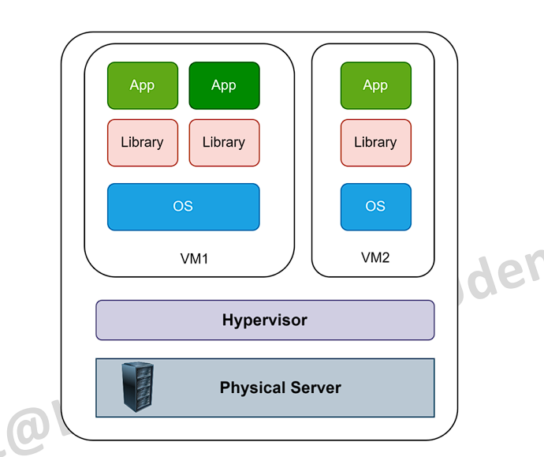
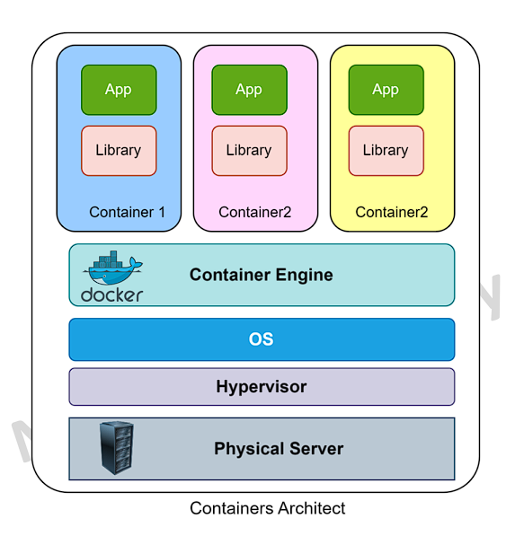
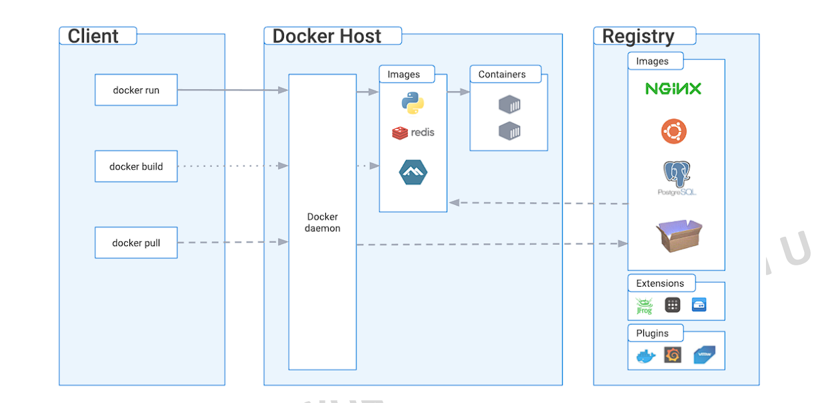
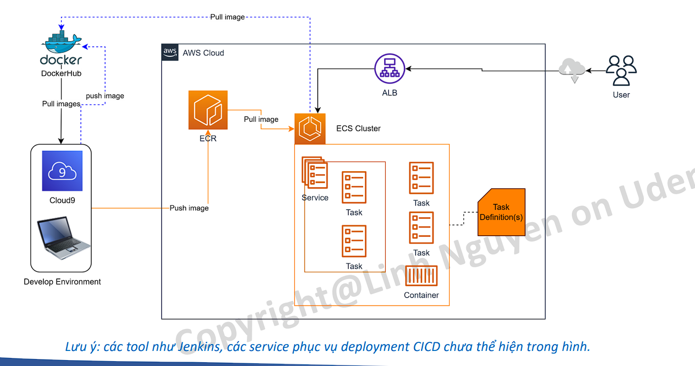
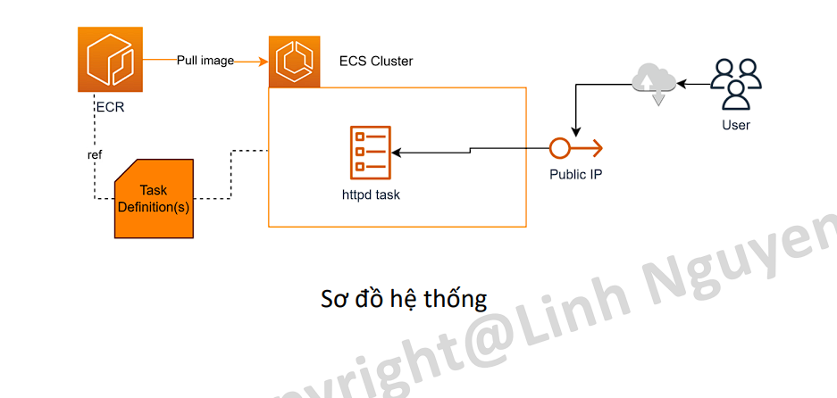
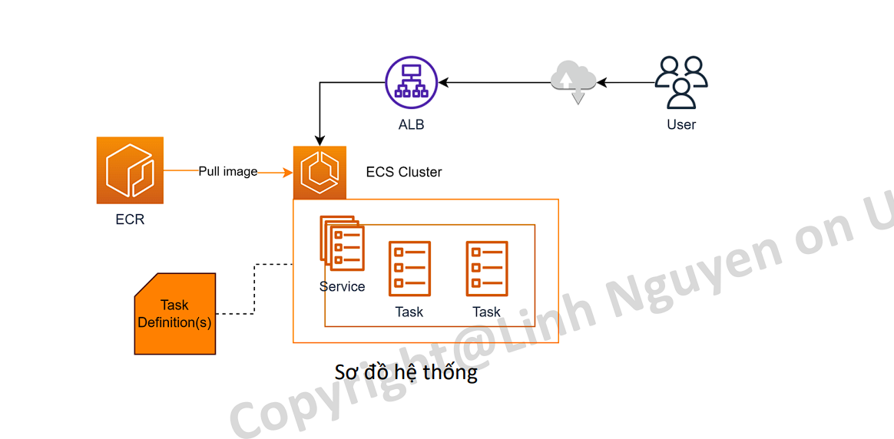
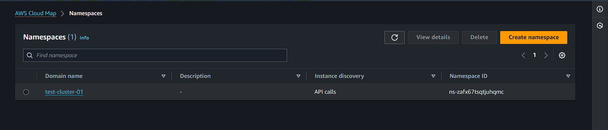
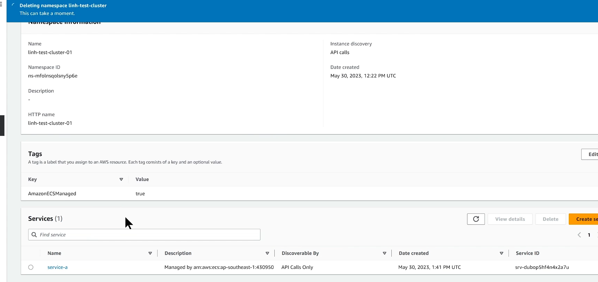

# Container là gì? Tại sao cần Container?

Cùng xét một mô hình vềviệc deployment sử dụng máy ảo (VM) hay các EC2 server.

- hypervisor: vmware, vituralbox
  

- Giả sử một ngày đẹp trời bạn được sếp giao nhiệm vụ install một software mới lên server production của công ty, bạn tìm hiểu rất kỹ càng những thư viện, runtime cần thiết của software này và đã tải về đẩy đủ.
- Đến ngày thực hiện, việc đầu tiên là bạn sẽ backup server (đương nhiên rồi ☺ )
- Bạn cài đặt một thư viện Jxxx version 20, tuy nhiên trong quá trình cài đặt Jxxx nói rằng không thể tồn tại 2 version song song trên cùng một máy và bạn phải gỡ version cũ hơn ra trước. Bạn gỡ version cũ là Jxxx 19 ra khỏi máy và cài Jxxx 20 vào (mới hơn tất nhiên là tốt hơn).
- Sau khi hoàn thành thao tác cài đặt software, bạn thông báo với sếp là đã xong việc. 30 phút sau, khách hàng gọi điện và claim về việc một số software trước giờ vẫn sử dụng bình thường thì hôm nay không khởi động lên được và văng lỗi thiếu thư viện. Và sau đó.... thôi không cần nói nữa...

## Problem khi sử dụng VM

• Xung đột version giữa Library, Binary, Runtime cùng cài trên các VM.
• Không có khả năng độc lập môi trường giữa các ứng dụng.
• Mất thời gian trong việc triển khai (chuẩn bị OS, cài các library cần thiết, setup môi trường,vv)
• Khó đảm bảo tính nhất quán của ứng dụng được triển khai (ứng dụng work OK trên một môi trường nhưng không chắc sang môi trường khác chạy bình thường).

## Container ra đời để giải quyết những vấn đề trên, bằng cách:

• Đóng gói ứng dụng cùng với những thứ cần thiết để chạy được ứng dụng đó thành một image có thể run ở bất cứ đâu có hỗ trợ container.
• Cung cấp môi trường & cơ chế cấp phát tài nguyên để image đó có thể run được.
• Cung cấp cơ chế & công cụ cho phép các nhà phát triển đóng gói, lưu trữ, phân phối và triển khai ứng dụng một cách thuận tiện.

## Lợi ích của việc sử dụng Container

1.Độc lập với môi trường: Containers cung cấp một cách để đóng gói ứng dụng và tất cả các dependencies của nó, bao gồm OS, libraries, tools. Nó cho phép ứng dụng chạy một cách độc lập và nhất quán trên bất kỳ môi trường nào.
2.Đơn giản hóa quy trình triển khai: tính nhất quán, tốc độ, thuận tiện là những gì Containerlize mang lại khi so sánh với mô hình truyền thống.
3.Quản lý tài nguyên hiệu quả: triển khai ứng dụng bằng Container cho phép bạn chia sẻ và sử dụng tài nguyên của hệ thống một cách hiệu quả. Bằng cách chạy nhiều container trên cùng một máy chủ vật lý hoặc máy ảo, bạn có thể tận dụng tối đa khả năng tính toán và tài nguyên của hệ thống.

## Lợi ích của việc sử dụng Container

1.Độc lập với môi trường: Containers cung cấp một cách để đóng gói ứng dụng và tất cả các dependencies của nó, bao gồm OS, libraries, tools. Nó cho phép ứng dụng chạy một cách độc lập và nhất quán trên bất kỳ môi trường nào.

2.Đơn giản hóa quy trình triển khai: tính nhất quán, tốc độ, thuận tiện là những gì Containerlize mang lại khi so sánh với mô hình truyền thống.

3.Quản lý tài nguyên hiệu quả: triển khai ứng dụng bằng Container cho phép bạn chia sẻ và sử dụng tài nguyên của hệ thống một cách hiệu quả. Bằng cách chạy nhiều container trên cùng một máy chủ vật lý hoặc máy ảo, bạn có thể tận dụng tối đa khả năng tính toán và tài nguyên của hệ thống.

4. Linh hoạt và mở rộng: Containers cho phép bạn dễ dàng mở rộng ứng dụng theo nhu cầu. Bằng cách scale horizontal, ứng dụng có thể mở rộng để đáp ứng workload. Ngoài ra, việc triển khai nhiều version của một ứng dụng cùng lúc cũng trở nên dễ dàng.4. Linh hoạt và mở rộng: Containers cho phép bạn dễ dàng mở rộng ứng dụng theo nhu cầu. Bằng cách scale horizontal, ứng dụng có thể mở rộng để đáp ứng workload. Ngoài ra, việc triển khai nhiều version của một ứng dụng cùng lúc cũng trở nên dễ dàng.

# Docker là gì?

Docker là nền tảng phần mềm cho phép bạn dựng, kiểm thử và triển khai ứng dụng một cách nhanh chóng. Docker đóng gói phần mềm vào các đơn vị tiêu chuẩn hóa được gọi là container có mọi thứ mà phần mềm cần để chạy, trong đó có thư viện, công cụ hệ thống, mã và thời gian chạy. Bằng cách sử dụng Docker, bạn có thể nhanh chóng triển khai và thay đổi quy mô ứng dụng vào bất kỳ môi trường nào và biết chắc rằng mã của bạn sẽ chạy được.

# Các thành phần cơ bản của Docker

• Docker daemon: là nơi quản lý các thành phần của Docker như image, container, volume, network. Docker daemon nhận API từ Client để thực thi các nhiệm vụ.
• Docker Client: Cung cấp phương thức để tương tác với Docker daemon.
• Docker registry: nơi lưu trữ các docker image. Mặc định docker sẽ connect tới docker registry là Docker hub.

\* Khi bạn cài Docker Desktop, Daemon và Client sẽ cùng nằm trên máy tính của bạn.

# Các bước cơ bản để xây dựng ứng dụng docker

1. Chuẩn bị Dockerfile: Dockerfile mô tả các bước cần thiết để tạo ra môi trường container chứa ứng dụng của bạn.
2. Xây dựng Docker Image: Sử dụng lệnh docker build để xây dựng Docker Image từ Dockerfile.
3. Kiểm tra Docker Image: Sử dụng lệnh docker images để kiểm tra danh sách các ảnh Docker có sẵn trên máy tính của bạn. Đảm bảo rằng Docker Image của ứng dụng của bạn đã được xây dựng thành công và xuất hiện trong danh sách.
4. Chạy Docker Container: Sử dụng lệnh docker run để chạy một container từ Docker Image.
5. Kiểm tra ứng dụng: Truy cập ứng dụng của bạn thông qua địa chỉ IP hoặc tên miền cùng với port đã chỉ định.

\* Trong thực tế khi triển khai lên môi trường Cloud sẽ bao gồm nhiều bước phức tạp hơn, sẽ được trình bày sau.

# Lab 1 – làm quen với Docker helloworld!

1. Run một docker image hello-world
2. Kiểm tra output.
3. Giới thiệu các câu lệnh cơ bản của Docker.

# Làm quen với Dockerfile

• Khai báo Base image: Dockerfile thường bắt đầu bằng một chỉ thị FROM để chỉ định base image mà new Docker image sẽ dựa trên. Ví dụ: FROM ubuntu:latest.
• Sao chép các tệp và thư mục: Sử dụng chỉ thị COPY hoặc ADD, bạn có thể sao chép các tệp và thư mục từ máy chủ nơi Dockerfile được chạy vào bên trong Docker image
Ví dụ: COPY app.py /app.
• Chỉ thị RUN. bạn có thể thực thi các lệnh bên trong hình ảnh Docker để cài đặt phần mềm, cập nhật gói phần mềm hoặc thực hiện các tác vụ khác.
Ví dụ: RUN apt-get update && apt-get install -y python.
• Thiết lập biến môi trường: Bằng cách sử dụng chỉ thị ENV, bạn có thể định nghĩa các biến môi trường cho hình ảnh Docker. Ví dụ: ENV LOGLEVEL=DEBUG.
• Mở port: Bằng cách sử dụng chỉ thị EXPOSE, bạn có thể xác định các cổng mà ứng dụng trong hình ảnh Docker sẽ lắng nghe. Ví dụ: EXPOSE 8080.
• Chạy ứng dụng: Bằng cách sử dụng chỉ thị CMD bạn có thể chỉ định lệnh mà Docker sẽ chạy khi khởi động một container từ hình ảnh.
Ví dụ: CMD ["python", "/app/app.py"]

# Lab 2 – Build and run custom image

Yêu cầu đã cài sẵn Docker Desktop (Mac or Windows đều được)
[text](../build-custom-docker-image)

1. Tạo một Dockerfile với base image httpd
2. Build image
3. Kiểm tra image đã được build
4. Chạy một container từ image đã được build

# Giới thiệu Elastic Container Registry

Elastic Container Registry (ECR) là một dịch vụ của AWS cung cấp khả năng quản lý và lưu trữ các Docker Image. ECR là một Registry dựa trên cloud computing, được thiết kế đặc biệt để làm việc với các container hóa và môi trường chạy container của AWS.
• Registry: đơn vị quản lý của ECR (giống một repository). Thông thường một Registry sẽ chỉ lưu image của một ứng dụng.
• Image: Tương tự Docker Image. Các Image trên Registry cần đánh tag để quản lý.

# Giới thiệu Elastic Container Service

Elastic Container Service (ECS) là một dịch vụ quản lý container đám mây do Amazon Web Services (AWS) cung cấp. Nó cho phép bạn chạy và quản lý các ứng dụng container trên nền tảng AWS một cách dễ dàng và linh hoạt.

# Các tính năng của ECS

1.Quản lý đơn giản. 2. Tích hợp với công cụ container: ECS tích hợp tốt với Docker, cho phép bạn chạy vcác container Docker trực tiếp trên nền tảng AWS mà không cần thay đổi mã nguồn hoặc cấu hình.
3.Mở rộng linh hoạt: Kết hợp với AutoScaling, ECS cho phép scale in-out linh hoạt dựa trên nhu cầu workload. 4. Tích hợp với các dịch vụ AWS khác: ECS tích hợp tốt với các dịch vụ AWS khác như Elastic Load Balancer (ELB), Elastic Container Registry (ECR), IAM, CloudWatch và nhiều dịch vụ khác. 5. Sự linh hoạt về kiến trúc: ECS hỗ trợ hai kiểu triển khai: EC2 Launch Type và Fargate Launch Type. Giúp bạn dễ dàng lựa chọn dựa theo nhu cầu cũng như khả năng customize của đội dự án.

# Các thành phần của ECS

• Cluster: Đơn vị lớn nhất của ECS, có nhiệm vụ cung cấp tài nguyên cần thiết (EC2, Fargate) để chạy ứng dụng.
• Task: Một đơn vị được cấp phát tài nguyên (CPU,RAM) trong mode Fargate. Một task có thể chứa 1 hoặc nhiều container.
• Service: Một nhóm các Task có chung nhiệm vụ được expose ra bên ngoài hoặc nội bộ cluster.
• Container: tương tự Docker Container, một runable image.
• ECS Connect Service: Cung cấp cơ chế service-to-service communication
• Task Definition (không có trong hình): chỉ dẫn để ECS biết phải tạo một task như thế nào. (giống launch template)

# Sample hệ thống triển khai trên sd ECS, ECR

# Lab 3 – Tạo và push image lên ECR

Yêu cầu: Build một custom image từ httpd, copy file index.html vào image. Tag và push image đó lên ECR.

1. Tạo một ECR repository vd: my-httpd
   (ecr => repository => create repository => name: "my-httpd" => Tag immutablity: (bật lên không ghi đè được tag, nếu ta có version 1.1 rồi nếu push lên 1.1 thì nó không cho, bật lên bảo vệ ghi đè image) => create )
2. Tạo một Dockerfile theo mẫu cung cấp sẵn.
   [text](../ecs-ecr-lab)
3. Build, tag image, push lên ECR theo chỉ dẫn.
4. Kiểm tra image đã được tạo ra trên ECR repository.

# Lab 4 – ECS Cluster - Run task

Yêu cầu: Sử dụng docker image đã build và push lên ECR từ bài lab trước, chạy một task trên ECS cluster, test truy cập.

Steps:

1. Tạo một ECS Cluster với mode Fargate
   (ecs => Cluster => create cluster => name: viettu-test-cluster => vpc: default => subnet: chọn cả 3 cái => Default namepsace: viettu-test-cluster (namepsace mà các service nó muốn comunicate với nhau) => Infrastructure code: Fargate => create )
2. Tạo một task definition với các thông số cơ bản.
   (ecs => task definitions => create new task definition => name: my-httpd-task-definition => container name: "my-httpd" -> image URI: 287925497349.dkr.ecr.ap-southeast-1.amazonaws.com/my-httpd:latest => cotnainer port: 80 => next => App environment: Fargate -> CPU: 0.25 -> Memory: 0.5 => Task role: (iam => create role => type: AWS service => AWS service: Elastic Container Service -> "Task" => next => add permistion (add đại một cái): Amazones3readonly => role name: "ecs-task-role" => create role): "ecs-task-role" (khi task chạy nên cần role gì để comunicate với service khác, một con ec2, lambda nó tương tác với s3, dynamicDb cần role) => task execution role: create new role (trong quá trình launch task này lên ECS cluster này cần một số role, vd role để pull image về, role ghi log lên cloud watch) => next => create)
3. Truy cập vào Cluster, run một task với task definition đã tạo. Lưu ý enable public IP để có thể test truy cập.
   (ecs => cluster => viettu-test-cluster => Tasks => Run new tasks => compute option: Capacity provider strategy -> capacity provider: Fargate => Application type: Task => task definition -> Family: "my-httpd-task-definition" -> Revision: 5 (LATEST) => Desired task: 1 (lanch mấy task) => Networking -> vpc: default -> subnet: cả 3 -> sg: default -> `public ip: on` => create )
4. Cấu hình security group nếu cần.
5. Thử truy cập tới public IP của Task (lưu ý số port).
   (Tasks => nhấp vô task => Configuration => public ip)

# Lab 5 – ECS Cluster - Run Service

Yêu cầu: Tạo một service https thay vì chạy task đơn lẻ, kết nối với ALB để có thể truy cập từ bên ngoài. Test việc điều chỉnh capacity của service.

Steps:

1. Tạo task definition (có thể tái sử dụng ở bài lab trước).
2. Tạo một Target group với type là IP, không add bất cứ gì. (target group nó giúp gom nhóm các service lại)
   (ec2 => target group => create tg => target type: `IP address` => name: viettu-test-ecs-tg => port: 80 => vpc: default => next => network: default => step 2 -> ip address: remove => create tg) (khi ecs tạo tạo task mới nó sẽ add vô group này)
3. Tạo một Application Load Balancer có listener 80 trỏ tới Target Group
   (ec2 => Loadblancer => create => ALB => name: viettu-test-alb => schema: internet facing => vpc: default => subnet: chọn 3 cái => sg: default => Listener -> port: 80 -> forward to: viettu-test-ecs-tg => create lb)
4. Tạo một service với task definition đã tạo, trong lúc tạo nhớ chọn ALB và Target Group tương ứng, enable Public IP (nếu không có NAT).
   (ecs => cluster => viettu-test-cluster => Serivces => create => compute option: Capacity provider strategy => Application type: Serivce => task definition -> Family: my-httpd-task-definition -> Reversion: latest -> serivce name: "my-httpd-serivce" -> service type: replica -> desired task: 2 => Service connect: turn on (nó một namepsace, trong trường hợp có nhiều service ta có thể đưa ra ra 1 ns và nó sẽ kết nối với n hau) -> service connect configuration: Client and server (client side only: service này có nhu cầu kết nối đến một service khác, Client and server: vừa có nhu cầu kết nối với 1 serivce khác và chính bản thân nó được kết nới bởi các serivce khác) -> namespace: "viettu-test-cluster" -> add port mapping and aplication -> port alias: "my-httpd-80-tcp" -> port: 80 => Networking -> vpc: default -> `public ip: turn on (bởi vì nó cần kết nối tới internet để pull image về, vì vpc không có  NAT)` => Load Balacing -> type: Aplication load blancer -> Use an exiting load balancer -> load balancer: "viettu-test-lb" -> choose container to load blancer: 'my-httpd 80:80' -> Listener: Use an exiting listener -> listener: '80:HTTP' => Target group: Use an exsiting target group -> group name: "viettu-test-ecs-tg" (lúc này service tạo task nó sẽ tự add IPv của task vô target group, khi ALB call đến nó tự forward request tới các task nằm trong service này) => Service auto scaling: `tích` Use service auto scaling -> min: 2 -> max: 4 -> type: target tracking -> policy name: 'Scale-by-cpu' -> metric: ECSSERviceAverageCPUUtilization -> target value: 70 -> Scale-out-cooldown period: 300 (delay 5p) -> Scale in: 300 (5p) => Create )
5. Đợi Service launch task thành công, test truy cập thông qua ALB.
   (truy cập thông qua LB => ec2 => LB => DNS name)
6. Thử điều chỉnh số lượng task trong service (scale).
   (services => update service => Desired task: 3, ASG -> min: 3, max: 5 => update)

==> Chú target group đứng sau ALB type lúc này không phải `instance` mà là `ip`, nhiệm vụ của service khi launch task mới nó sẽ add vào trong target group này, và load bancer nó sẽ forward request tới target group và random trong 3 task trong service

# Giới thiệu Cloud Map

(cloud map giúp ta tạo ra namespace để các service khác call vô)
• AWS Cloud Map là một “Cloud Service Discovery”. Với Cloud Map, bạn có thể xác định tên tùy chỉnh cho các tài nguyên ứng dụng của mình và dịch vụ này duy trì vị trí cập nhật của những tài nguyên thay đổi linh hoạt đó. Điều này làm tăng tính sẵn sàng của ứng dụng vì dịch vụ web của bạn luôn tìm ra vị trí mới nhất của các nguồn tài nguyên.
• Cloud Map cho phép bạn đăng ký bất kỳ tài nguyên ứng dụng nào, chẳng hạn như DB, queue, micro service và cloud resource khác, với tên tùy chỉnh. Sau đó, Cloud Map liên tục kiểm tra tình trạng của tài nguyên để đảm bảo vị trí được cập nhật. Sau đó, ứng dụng có thể query đến registry để biết vị trí của các tài nguyên cần thiết dựa trên phiên bản ứng dụng và môi trường triển khai.
• Một trong những ứng dụng phổ biến của AWS Cloud Map là trong kiến trúc dựa trên microservices. Bằng cách sử dụng Cloud Map, bạn có thể quản lý và theo dõi các dịch vụ ứng dụng microservice một cách linh hoạt và tự động.

==> Bản chất nếu ta có nhiều hơn 1 service và 2 service lại có như cầu kết nối tới nhau, thì nó kết nối với nhua thông qua cái gì , không lẽ ta hard code ip trong từng con instance, thì ta phải cấu hình service nhận một cloud map namespace để khi nó khởi động serice lên nó sẽ biết là tôi phải đăng ký service a vô namespace là service-a.local rồi service b cũng biết nó phải cần phải đăng ký task vô namespace tức là service-b.local, 2 service này chỉ biết tên của nhau thôi, không biết thực sự ip đằng sau là gì

==> khi ta tạo cluster ecs ta có chọn tạo namepsace, thì nó cũng tạo namespace ở trên cloud map cùng tên với cluster luôn
(cloud map => viettu-test-cluster => create service (bật cloudmap lên thì service sẽ đăng ký một record trong cloud map này và các service khác sẽ call qua))

## LAB nhanh

(ecs => service => create services => service name: "service-a" => Service connect -> turn on Service Connect -> Client and server => namespace: viettu-test-cluster -> Add port mapping and aplication -> port alias: my-httpd-80-tpc -> discovery: 'service-a' -> DNS: 'cluster.local' -> port: 80 => các option khác tương tự như trên => create)
(qua cloud map => "viettu-test-cluster" => service (sẽ thấy có 1 service name: 'service-a' ))

==> khi các service khác muốn connect tới "service-a" thì nó chỉ cần trong cluster nó call đến "service-a.viettu-test-cluster" thôi, thì nó sẽ call được service này

==> Cloud map thường được sử dụng để kết hợp với ecs để quản lý việc internal service comunication giữa các service với nhau trên cùng backend

# Clear resources

1. Login to AWS console.
2. Stop toàn bộ ECS task.
3. Xoá toàn bộ ECS service
4. Xoá ECS Cluster.
5. Xoá Application Load Balancer.
6. Xoá Repository trên ECR.
7. Xoá Cloud9 environment.
