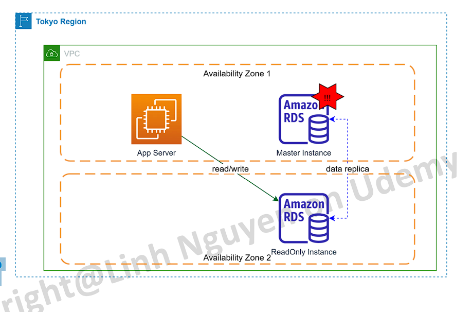
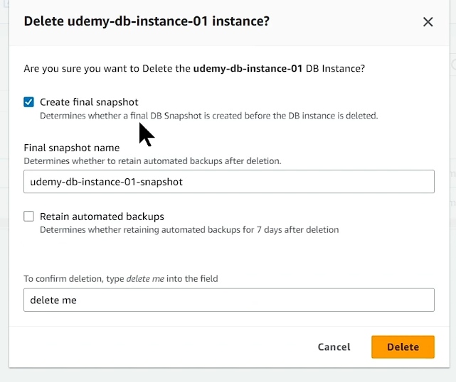
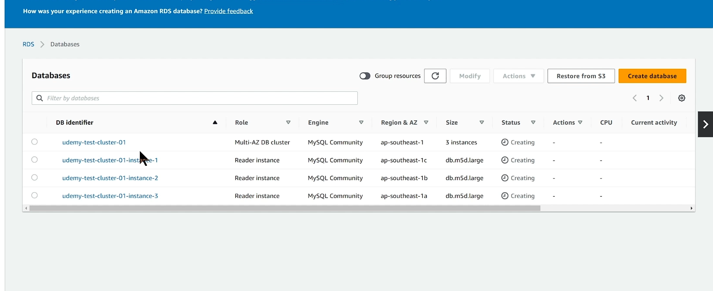
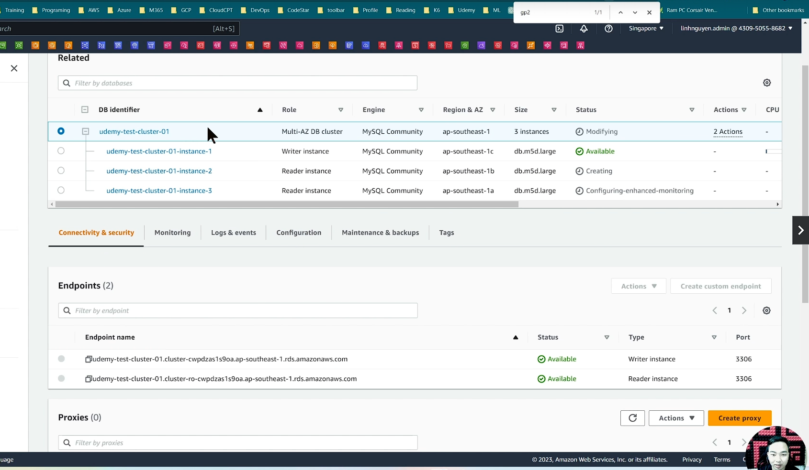
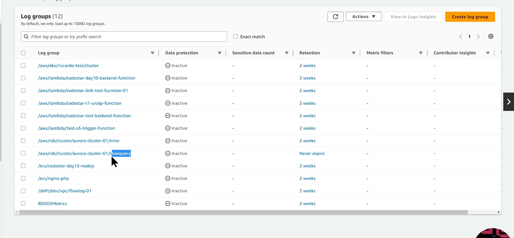
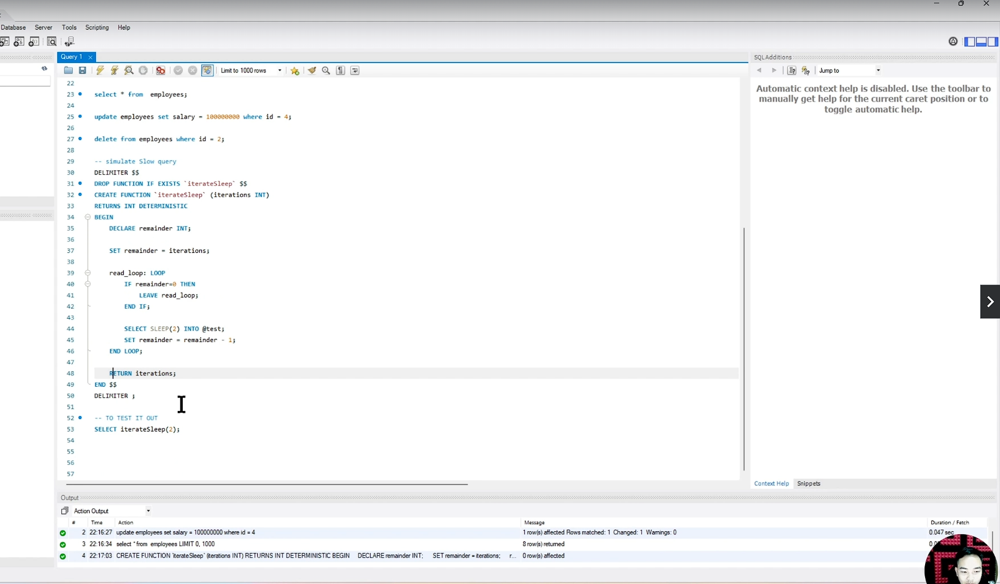

# What is RDS

- Viết tắt của Relational Database Service
- Là một service giúp người dùng tạo và quản lý các Relational Database.

# Đặc trưng cơ bản của RDS

• Là một Database as a Service. User không cần quan tâm tới hạ tầng ở bên dưới.
• Cho phép người dùng tạo ra các database instance độc lập hoặc cụm instance hoạt động dưới mode Cluster.
• Không thể login vào instance level (khác với việc tự cài DB lên 1 EC2 instance).
• Có thể scale theo 2 hình thức
o Scale virtical: tăng hoặc giảm cấu hình instance.
o Scale horizontal: thêm hoặc bớt node tuy nhiên node này chỉ có thể read (read-replica).
• Có giới hạn về dung lượng ổ cứng tối đa (64TB đối với MySQL, Maria,... 16TB đối với Microsoft SQL).

# Features of RDS

RDS cung cấp các tính năng cơ bản sau:
• Cho phép tạo các DB Instance hoặc cụm cluster một cách nhanh chóng.
• Tự động fail-over giữa master-slave instance khi có sự cố.
• High-Availability: tự động cấu hình instance stand by, người dùng chỉ cần chọn.
• Tự động scale dung lượng lưu trữ (optional) (nếu bật lên khi lưu trữ hết dung lượng sẽ tự động tăng dung lương ổ cứng lên database)
• Liên kết với CloudWatch để giám sát dễ dàng.
• Automate backup & manage retention. (sự giự lại)
• Dễ dàng chỉnh sửa setting ở cấp độ Database sử dụng parameter goup.

# RDS supported engines

RDS Hỗ trợ các engines sau:


\*Aurora hiện tại chỉ hỗ trợ 2 engine là Aurora MySQL và Aurora PostgreSQL

# RDS Usecase

- RDS được sử dụng trong hầu hết các trường hợp cần database dạng quan hệ. Vd: lưu trữ thông tin của user, website e-commerce, education,...
- RDS thích hợp cho các bài toán OLAP (Online Analatical Processing) (tập chung vào việc phân tích query) nhờ khả năng truy vấn mạnh mẽ, cấu hình có thể scale theo yêu cầu.

# RDS Pricing

Về cơ bản RDS tính tiền dựa trên các thông số
• Instance size. Instance size càng lớn cost càng cao. Có hỗ trợ reserve instance tương tự EC2.
• Lượng data lưu trữ (GB/month)
• Dung lượng các bản snapshot được tạo ra. (giá snapshot sẽ rẻ hơn)
• Các tính năng khác vd Backtracking đối với Aurora.

# Mô hình triển khai RDS

RDS Có thể được triển khai theo một số mô hình sau
• Single Instance
• Single Instance with Multi-AZ option = yes
• Master – Read Only cluster
• Master – Read Only cluster with Multi-AZ option = yes (bật Multi-AZ cho từng Node)
• Master – Multi Read cluster

## Single Instance


- Chỉ có 1 database instance duy nhất được tạo ra trên 1 Availability Zone (AZ)
- Nếu sự cố xảy ra ở cấp độ AZ, database không thể truy cập.
- Phù hợp cho môi trường Dev-Test để tiết kiệm chi phí

## Single Instance with Multi-AZ option enabled


- Một bản sao của instance sẽ được tạo ra ở AZ khác và hoạt động dưới mode standby. (không nhình thấy instance này và không truy cập được vào nó, chỉ biết Amazone sẽ tạo ra 1 con instance ở mode standby)
- Nhiệm vụ của instance standby này là sync data từ master, không thể truy cập instance này. (Nhiệm vụ nó sync data liên tục, khi có sự cố xảy ra thì con này sẽ chuyển thành master)


\*Instance standby được AWS tạo ra tuy nhiên user không thể kết nối tới instance này.

- Khi có sự cố, instance standby sẽ được chuyển lên thành master (việc này được AWS thực hiện tự động, endpoint url được giữ nguyên).
- Nếu enable multi AZ, số tiền bỏ ra sẽ x2.
- Phù hợp cho Database Production.

## Master – Read Only cluster


\*Instance read-only không nhất thiết phải khác AZ với Master

- Một instance với mode ReadOnly sẽ được tạo ra và liên tục replica data từ master instance.
- Instance này chỉ có thể đọc data. Phù hợp cho hệ thống có workload read>write, muốn tối ưu performance của Database.
- Sau khi thiết lập quan hệ, instance được tạo ra sẽ kết hợp thành 1 cluster.



- Trong trạng thái 2 instance đã hình thành cluster, nếu Master instance gặp sự cố, failover sẽ được tự động thực hiện, ReadOnly instance được promote lên làm Master.

\* Lưu ý: Nếu 2 instance được tạo ra riêng biệt sau đó mới thiết lập quan hệ read-replica, endpoint của 2 instance sẽ riêng biệt nên sau khi failover, cần chỉnh lại connection từ App.

\* Nên tạo cluster sau đó mới add node read vào để quản lý connection ở cluster level (số lượng node read có thể tuỳ chọn)

# Master – Read Only cluster with Multi-AZ option = yes


- Tương tự mô hình Master – Read Only tuy nhiên các node đều được bật multi-AZ enabled.

- Chi phí sẽ gấp 4 lần mô hình Single Instance.

# Master – Multi Read cluster


- Với mô hình này, nhiều hơn 1 reader instance sẽ được tạo ra.

## Nên tạo RDS Cluster hay RDS Instance?

- AWS cung cấp cơ chế cho phép tạo ra 1 cluster RDS giúp quản lý node và failover dễ dàng hơn.
- Ưu điểm so với việc tạo RDS instance thông thường:
  • Quản lý endpoint ở cấp độ cluster, không bị thay đổi khi instance trong cluster gặp sự cố. (giả sử instance đó bị faild hoặc amazone có vấn đề thì nó sẽ switch sang cái zone tiếp theo, con slave sẽ thành master )
  • Failover tự động.
  • Scale read instance dễ dàng.

## Nên tạo RDS Cluster hay RDS Instance?


(Ta tạo một RDS cluster lúc này app server chỉ cần biết đến endpoit read và write của cluster thôi không cần biết endpoint của những con instance ở trong, khi master gặp sự cố thì 1 trong 2 con read sẽ lên làm master, lúc này url sẽ không cần cập nhật lại vì là endpoint của cluster)

# Lab 1 – RDS Basic Operation

\*Yêu cầu cài sẵn MySQL Workbench

1. Login to AWS console, navigate to RDS
2. Tạo 1 RDS instance với cấu hình cơ bản db.t3.medium, engine MySQL
   (RDS => Database => create database => method: Standard create => Engine type: Mysql => Engine version: mặc định => Template: Dev/Test => Deployment option: Single DB instance => DB identiier: udemy-db-instance-01 => Master uername: admin => chọn Self managed => Master password: "viettu123" => DB instance class: Burstable class (m, r, x khá mắc tiền) -> db.t3.medium => Stroage type: IOS SSD gp3 => Allocated stroage: 20 (GB) => Stroage autoscaling: tích (nều sài hết sẽ tăng thêm ổ cứng) => vpc: default=> subnet gruop: default (bản chất là 1 nhóm subnet, chỉ ý nghĩa là db trong mod multi AZ sẽ có 1 instance ở subnet này và 1 insatnce ở subnet kia ) => public access: Yes (chọn No không cách nào kết nối Db) => Security group: default => Avaibili zone: (nếu không chọn thì nó sẽ random 1 trong az) => create database )
   (DB => udemy-instance-01 => chọn vào security group => edit rule => add rule => chọn MYSQL/Aurora => srouce: My ip => save rule)
3. Kết nối tới instance sử dụng MySQL Workbench
   
   
   
4. Thực hiện 1 số câu lệnh CRUD cơ bản.
   
   Sẽ thấy mọt Db đực tạo ra
   
   
   Update
   
5. Tạo thêm instance với role Read Replica.
   (udemy-db-instance-01 => Action => create read replica => identifer: udemy-db-instance-read-replica => db instance class: burstable class -> db.t3.medium (giống với con master) => seting khác mặc định => deployment option: Single DB instance => public access: tích bật lên => create replica)
   (Enpoint của 2 db này không giống nhau => phải tạo kiểu cluster)
   
6. Kết nối tới Read instance sử dụng MySQL Workbench
   
   Vì là replica lên setting nó giống con master kể username password
   
7. Thực hiện 1 số câu lệnh CRUD cơ bản => Read only.
   Có luôn database "company" tạo ở db master (chưa làm gì hết)
   
   
   Bây h ở db master thủ 1 vài thao tác để xem con replica có bị thay đổi theo không => insert thêm
   
   
   Bây giờ select ở con replica xem có update data mới không => Thấy có data mới từ con master
   
   Thủ update data ở replica xem được không => sẽ báo lỗi Mysql server is running with the --read only option so it cannot exec this statement
   
   ==> Bản chất replica sinh ra để share wordload với con master và endpoint sẽ khác do ta tạo 2 instance riêng lẻ xog mới ghép lại với nhau
8. Test delete Master Intance => Kiể tra xem có failover không
   
   
   (chọn con primary => Action => Delete)
   
   2 Con server lúc này sẽ không còn quan hệ cluster nữa
   
   Con instance replica đã chuyển thành master (thực ra là single instance)
   
   Kiểm tra update, insert, delete trên con instance vừa chuyển thành primary => Thủ update thì thành công
   
   Thử update user
   

## Nó thêm về tính năng RDS Snapshot

- Là cơ chế giúp ta recovery database khi có sự cố xảy ra, giống EC2 snapshot
- Bây h tôi có 1 bản snapshot và giả sử data có sự cố tôi muốn recovery về bản snapshot gần nhất
  
  (Chọn snapshot => Action => Resotre snapshot (nó sẽ quy về giao diện tạo db mới, username và password nó sẽ ăn theo giống bản snapshot) )

# Lab 2 – RDS Cluster

1. Login to AWS console, navigate to RDS
2. Tạo 1 RDS Cluster.
   (RDS => Database => Create database => Engine type: Mysql => tmeplate: Dev/test (Producnt thì cấu hình nó cao) => deployment option: Multi-AZ DB Cluster => identifier: "udemy-test-cluster-01" => master username: admin => master password: "viettu123" => Db instance class: Standard classes -> db.m5d.large => Stroage type: IPOS SSD (io1) => Allocated stroage: 100 => Provisioned IOPS: `1000` (để nhiều nó sẽ rất tốn tiền ngay lập tức) => vpc: default => public access: yes => sg: default => create dataabase )

Nó tạo sẽ 3 con read luôn mặc dù ta không chỉ định số lượng read

và 3 con read này đều được bật MUlti AZ tới 3 Zone lận tổng cộng ta tốn đến 9 lần tiền so với tạo single instance


Và nó sẽ phân chia role, 1 con Writer instance và 2 con Reader instnace


Đúng như mô hình đã chình bày thì nó 2 endpoint là 1 endpoint writer không có ký hiệu ro và 1 endpoint reader ký hiệu ro

Tích vô từng con instance db vẫn sẽ có endpoint riêng của từng con tuy nhiên ta sẽ không sử dụng endpoint của từng instance này vì khi faild over sảy ra thì ta sẽ tự cập nhật trên application => thay vào đó ta sẽ dùng 2 endpoint của cluster
 3. Kết nối với Cluster thông qua Cluster Write Endpoint.
(chý ý: kiểm tra security group xem có mở port chưa và MY IP đúng chưa)
 4. Thực hiện 1 số câu lệnh CRUD cơ bản.

 5. Kết nối với Cluster thông qua Cluster Read Endpoint.

Thủ insert xem được không => lỗi không insert được

 6. Thực hiện 1 số câu lệnh CRUD cơ bản.

# Aurora

- Aurora là công nghệ database độc quyền của AWS, hỗ trợ 2 loại engine là MySQL và PostgreSQL.
- Aurora có 2 hình thức triển khai:
  o Cluster (Master + Multi Read Replica)
  o Serverless
- Những tính năng vượt trội của Aurora so với RDS thông thường
  o Hiệu năng tốt hơn (so với RDS instance cùng cấu hình. \*Cái này là AWS quảng cáo ☺)
  o Hỗ trợ backtracking (1 tính năng cho phép revert database về trạng thái trong quá khứ tối đa 72h). Khác với restore từ snapshot đòi hỏi tạo instance mới backtracking restore ngay trên chính cluster đang chạy.
  o Tự động quản lý Write endpoint , Read endpoint ở cấp độ cluster.

# Mô hình cluster của Aurora


- Cluster Aurora bao gồm:
  • 1 Master node (Primary instance)
  • 1 hoặc nhiều Replica node (tối đa 15)
- Data của Aurora cluster được lưu trên một storage layer gọi là Cluster Volume span trên nhiều AZ để tăng HA.
- Data được Cluster Volume tự động replicate trên nhiều AZ. \*Số lượng copy không phụ thuộc vào số lượng instance của cluster. (giả sử ta có 3 con instance thì số lượng bản copy sẽ được tự động amazon tính toán và nó lưu phù hợp trên các zone làm sao khi có sự có zone xảy ra thì nó không bị biến mất, nó không phụ thuộc việc ta chỉ có 1 instance thì nó chỉ copy ở một zone)
- Cluster Volume tự động tăng size dựa vào nhu cầu của người dùng (không thể fix cứng size).

# Mô hình cluster của Aurora

## Aurrora Global Cluster


\* Khác với RDS thông thường, Aurora sử dụng tầng Storage để replicate data giữa master-read nodes (điều này sẽ khiến cho việc replica data từ Node primary sang node replica không tiêu tốn cpu và memory của bản thân con instance => cho nên tốt hơn về mặt hiệu năng)

- Là một cơ chế cho phép tạo ra cụm cluster cross trên nhiều regions.
  • Tăng tốc độ read tại mỗi region tương đương với local read. (giả sử ta có server đặt tại tokio nhưng lại có lượng khách hàng tiềm năng ở đặt ở singapor, ta muốn người ta có thể read data ở tốc độ nhanh thì ta dùng mô hình Global Cluster)
  • Mở rộng khả năng scale số lượng node read (limit 15 read nodes cho 1 cluster).
  • Failover, Disaster recovery: rút ngắn RTO và giảm thiểu RPO khi xảy ra sự cố ở cấp độ region. (giả sử người dùng ta có 2 region ở tokio và singapor, khi xảy ra hỏng hóc ở toàn region tokio chúng ta vẫn có thể switch wordload đó sang singapor )
- Mặc dịnh cluster ở region thứ 2 trở đi chỉ có thể read, tuy nhiên có thể enable write forwarding để điều hướng request tới primary cluster. (write ở region thư 2 sẽ được forward lại region thứ nhất)

# Mô hình Serverless của Aurora

• Aurora Serverless là 1 công nghệ cho phép tạo Database dưới dạng serverless. (không có các Node)
• Thay vì điều chỉnh cấu hình của DB instance, người dùng sẽ điều chỉnh ACU (Aurora Capacity Unit), ACU càng cao hiệu suất DB càng mạnh.
• Phù hợp cho các hệ thống chưa biết rõ workload, hoặc workload có đặc trưng thay đổi lên xuống thường xuyên.

# Lab 3 – Aurora

1. Tạo Aurora Cluster với 2 instance (một Write, một Read-replica).
   (RDS => Create database => engine type: Aurora Mysql => Mysql version: mysql 5.7 (tại sao không dùng mới nhất, vì version 8 chưa hộ trỡ back tracking) => Template: Dev/Test => Identifier: "aurora-cluster-01" => master username: admin => master password: "viettu123" => Db instance class: Burstable class -> db.t3.medium => Multi-AZ deployment: Create an Aurora Replica or Reader node (tạo sẵn Node Read, chải nhiệm khả năng có một `node` write và read) (tạo thêm 1 bản sao cho mỗi instance và bản sao chạy dưới mode slave và ta không kết nối được đến nó, khi nào có sự cố ở bản chính thì nó mới swtitch qua thôi) => vpc: default => public access: yes => sg: default => Additional configuration -> Back track: tích Enable Bactrack -> 24 (để càng lâu càng tốn tiền)(chọn thời gian tua ngược, tối đa 72 tiếng, nêu ta chỉnh sửa data có bị mất data, ta hoàn toàn có thể backtrack lại 72 tiếng trước) => Log export -> bật erro log, bật slow query log => Maintenance: (nếu bật lên thì khoảng thời gian nào đó nó sẽ tự động nâng cấp, bởi vì rds là manage service lên amazon làm cho ta rồi) => create database )

Nó sẽ tạo 1 cluster có 2 con instance, 1 con write và 1 con read


Cluster endpoint (không sử dụng instance endpoint)


Chú ý scurity group đã mở port MYSQL/Aurora 2. Kết nối đến Cluster sử dụng Write endpoint.

Tạo db và table
 3. Thực hiện một số thao tác đơn giản (CRUD).

Update lại
 4. Enable tính năng back tracking
(Nếu trưa enable => chọn cluster => chọn Modify => Enable backtrack => save )
 5. Đợi khoảng 5 phút. 6. Xoá toàn bộ data.
Chạy câu lệnh delete vài row data


7. Thực hiện back tracking về 5 phút trước đó. (lúc 9h40 xóa data) (tua ngược thời gian trên chính cái database này và nó không tạo lại cái cluster mới, bản chất back tracking nó dùng transaction log)

(Chọn cluster => Action => Backtrack => chọn thời điểm 9h38 lúc đó chưa xóa data => Backtrack DB cluster )


Đợi vài phút thì backtracking xog
 8. Kiểm tra data đã được phục hồi lại trạng thái trước khi bị xoá.
Kiểm tra data có được khôi phục không

Đã phục hôi lại data => lục 9h40 xóa chỉ giữ lại 1 row, bh đã có lại toàn bộ data (Backtraking muốn chạy bao nhiêu lần cũng được nếu còn trong khoảng thời gian setting)


# Parameter Groups

• RDS là một managed service do đó `không thể login vào instance`. Nếu muốn can thiệp vào setting ở cấp độ DB (không phải setting OS) ta cần thông qua 1 cơ chế
gián tiếp là Parameter Groups.
• Khi tạo RDS nếu không chỉ định gì AWS sẽ sử dụng Parameter Group default của hệ database đang chọn. Default Parameter Group không thể chỉnh sửa.


• Custom Parameter Group được tạo ra bằng cách copy default Parameter Group sau đó chỉnh sửa những tham số phù hợp với nhu cầu.
• Parameter Groups có 2 loại là Cluster Parameter Groups và Instance Parameter Group. Hai loại này khác nhau về scope có thể apply. (cluster thì apply cho cluster, instance apply cho instance, khi apply cho cluster prameter goup thì bản thân nó sẽ đồng bộ setting xuống từng con instance trong thôi)


# Parameter Groups

Một số Parameter thường được custom riêng theo nhu cầu hệ thống


# Option Groups

- Tương tự Parameter Group tuy nhiên Option Group định nghĩa những setting liên
  quan tới Security là chủ yếu
- Một số ví dụ về option group:
  o SERVER_AUDIT_EVENTS: Loại action sẽ được log ra, vd: CONNECT, QUERY, QUERY_DDL, QUERY_DML, QUER
  o SERVER_AUDIT_INCL_USERS: Inlcude users vào audit log.(User nào khi thực hiện một số hành động thì log ra log audit)
  o SERVER_AUDIT_EXCL_USERS: Loại trừ users khỏi audit log (vd system user).
  o SERVER_AUDIT_LOGGING: Bật tắt audit logging.

# Lab 4 – RDS Parameter Groups


1. Tạo 1 Parameter Group từ default MySQL 5.x
   (RDS => Parameter groups => create parameter group => family: aurora-mysql5.7 (bởi vì mysql đang chạy là 5.7) => type: DB cluster Parameter Group => group name: "udemy-mysql-custon-cluster-parameter-group" => create)
2. Setting các thông số như bảng sau
   (Bấm vô udemy-mysql-custon-cluster-parameter-group => Edit parameter => đầu tiên: max_connections: 100 => max_allowed_packet: 100MB (như ảnh) => long_query_time: 0.5 (query nào chạy chậm hơn 0.5s coi là slow query) => show_query_log: 1 (có log ra show query không) => Save change )
3. Apply Parameter Group đó cho 1 cluster.
   ( RDA => Database => chọn cluster => Modify => DB option -> Db cluster parameter goup -> chọn cái "udemy-mysql-custon-cluster-parameter-group" => continue => chọn Apply immediately (Sẽ có nữa chọn apply ngay lập tức hay apply vào thời điểm maintein) => modify cluster)


Phải rebot lại instance

Kiểm tra

Vô cloudwatch kiểm tra xem nó log ra không
(cw => log groups => query nào slow nó sẽ log ra, câu query nào chạy chậm để sớm phát hiện ra query nào chạy chậm)


Câu lệnh chạy giả lập phần slow_query

```sql
-- SIMULATE SLOW QUERY
DELIMITER $$
DROP FUNCTION IF EXISTS `iterateSleep` $$
CREATE FUNCTION `iterateSleep` (iterations INT)
RETURNS INT DETERMINISTIC
BEGIN
    DECLARE remainder INT;

    SET remainder = iterations;

    read_loop: LOOP
        IF remainder=0 THEN
            LEAVE read_loop;
        END IF;

        SELECT SLEEP(2) INTO @test;
        SET remainder = remainder - 1;
    END LOOP;

    RETURN iterations;
END $$
DELIMITER ;

-- TO TEST IT OUT
SELECT iterateSleep(2);

```



Chạy lệnh select (câu query sẽ chạy mất 2s sẽ lơn hơn 0.5 mà ta setting trên cluster)


Qua cloudwatch log group

Nó sẽ log ra câu query đó chạy chậm


# RDS Proxy

• RDS cung cấp cơ chế proxy giúp quản lý connection tới các instance một cách
hiệu quả, hạn chế bottle neck (VD: do application quản lý connection không tốt gây ra).
• Khi sử dụng proxy, application sẽ không kết nối trực tiếp tới RDS mà thông qua proxy endpoint.
• Chi phí sẽ phát sinh thêm cho proxy.
• Hiện tại hỗ trợ 3 engine: MySQL, PostgreSQL, SQL Server

## Sở đồ hệ thống

(Proxy sinh ra để quản lý connection, làm tăng connection tối đa mà client có thể request, vừa nãy có đề cập vấn đề số lượng connection của db nó phụ thuộc vào cái site của instance và giới hạn về mặt số lượng)


# Clear resources

Login vào AWS Console và thực hiện những nội dung sau

1. Xoá RDS Instance
2. Xoá RDS Cluster (cỏ thể xóa toàn bộ)
3. Xoá Aurora Cluster (Xóa từ instance xóa lên)
4. Xoá các bản snapshot còn sót lại
5. Terminate EC2 instance nếu có
