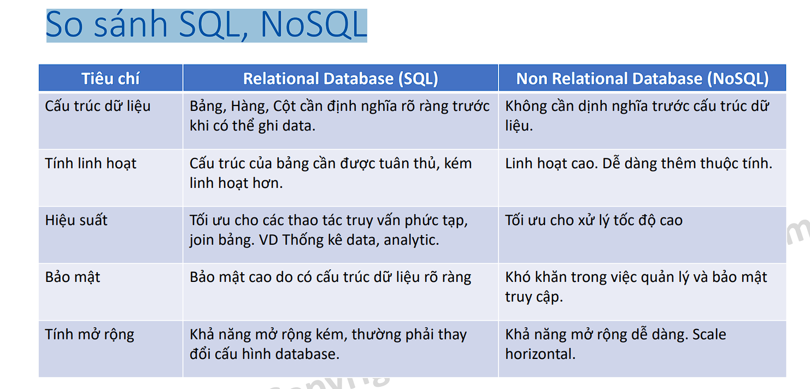
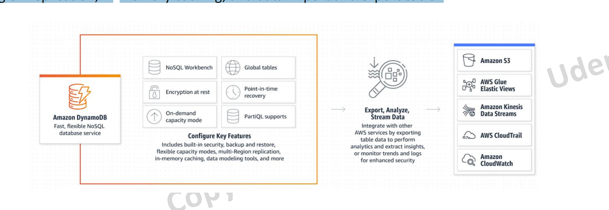
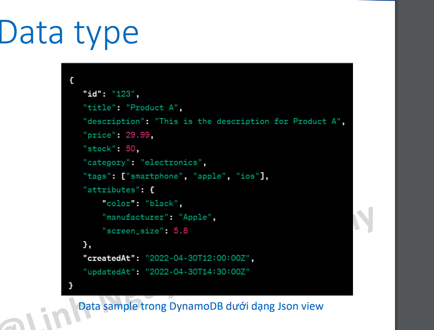

# NoSQL là gì?

Non-Relational Database, còn được gọi là NoSQL (Not Only SQL) là một hệ thống cơ sở dữ liệu mà không sử dụng mô hình quan hệ truyền thống dưới dạng các bảng và các quan hệ khóa ngoại. Thay vào đó, nó sử dụng một cấu trúc dữ liệu khác, phù hợp hơn với các ứng dụng có khối lượng dữ liệu lớn, tốc độ truy vấn nhanh và tính mở rộng cao hơn.

# Một số mô hình NoSQL

• Key-value: Lưu trữ dữ liệu dưới dạng các cặp key-value (khóa-giá trị). Các khóa được sử dụng để truy cập và lấy dữ liệu, trong khi giá trị có thể là bất
kỳ kiểu dữ liệu nào.
• Document: Lưu trữ dữ liệu dưới dạng tài liệu, thường là định dạng JSON hoặc XML. Các tài liệu được lưu trữ theo dạng phi cấu trúc, cho phép dữ liệu được lưu trữ một cách linh hoạt và thêm vào dễ dàng.
• Column oriented: Lưu trữ dữ liệu dưới dạng các bảng với hàng và cột, nhưng khác với cơ sở dữ liệu quan hệ, các cột có thể được thêm và loại bỏ một cách độc lập.
• Graph: Lưu trữ dữ liệu dưới dạng các nút và mối quan hệ giữa chúng, cung cấp khả năng xử lý dữ liệu phức tạp.

# So sánh SQL, NoSQL

- Cấu trúc dữ liệu
- Tính linh hoạt: nosql dễ dàng thêm thuộc tính
- Hiệu suất: nosql tối ưu cho tốc độ cao, đọc nghi => Nếu hệ thống vừa cần phân tích, lại vừa cần đọc ghi cao thì ta kết hợp 2 loại db lại ta sẽ có lợi điểm của 2 db
- Bảo mật: Sql sẽ bảo mật có hơn do cấu trúc dữ liệu dõ dàng nên ta có thể setting phân quyền vd: tùy theo role có thể read hay wirte không, còn với nosql khó khăn trong việc quản lý và bảo mật truy cập
- Tính mở rộng: sql sẽ kém hơn, ta đã biết được là RDS chỉ có thể scale vertical (dọc) nếu muốn scale node write, còn scale node read ta có horizontal nhưng ta chỉ có thể add thêm Node Read, còn riêng với NoSql thì đa số ta có thể scale dạng cluster ta muốn cluster mạnh hơn chứa nhiều data hơn thì add thêm Node vô cluster chứ không tăng cấu hình
  

# DynamoDB là gì?

“Amazon DynamoDB is a fully managed (không có cài cắm gì hết, chỉ là người dùng), serverless (không quan tâm server đằng sau), key-value NoSQL database designed to run high-performance applications at any scale. DynamoDB offers built-in security, continuous backups, automated multiRegion replication, in-memory caching, and data import and export tools.”

# Đặc trưng của DynamoDB

• Serverless: hạ tầng được quản lý bởi AWS. User tương tác với DynamoDB thông qua Console, CLI, Các tool client hoặc Software SDK.
• Data được tổ chức thành các đơn vị table
• Độ trễ thấp (single digit milisecond)
• SLA: 99.999% availability
• Automatic Scale Up/Down tuỳ theo workload (WCU, RCU)
• Kết hợp được với nhiều service khác của AWS

# Đặc trưng của DynamoDB

- Ưu điểm
  • Serverless nên chi phí vận hành thấp, tính khả dụng cao.
  • Linh hoạt trong cấu hình (zero idle cost, phù hợp cho startup)
  • Khả năng scale không giới hạn (về lý thuyết), độ trễ thấp, hiệu suất cao.
  • Strongly consistency (tránh việc read after write đọc trúng data cũ)
  • Hỗ trợ mã hoá
- Nhược điểm
  • Không phù hợp với data query và analytic (OLAP)
  • Thiếu tính năng khi so sánh với SQL (relational DB)

# DynamoDB usecases

• Software application: hầu hết các software có nhu cầu về high concurrent cho hàng triệu user đều có thể cân nhắc sử dụng DynamoDB. Vd E-commerce.
• Media metadata store: Lưu trữ metadata cho các media.
• Gaming platform
• Social media: mạng xã hội, bài đăng, bình luận.
• Logistic system.
• Ứng dụng IoT

# DynamoDB usecases

- Một số công ty nổi tiếng có sử dụng DynamoDB có thể kể đến:
  • Amazon
  • Samsung
  • Ubisoft
  • Netflix
  • Airbnb
  • ShipStation
  • Jira
  • Grab

# DynamoDB Pricing

DynamoDB tính tiền trên các thông số
• Write Capacity Unit (WCU) và Read Capacity Unit (RCU). Hai đơn vị này lại có 2 mô hình tính giá là On-demand và Provisioned Capacity.
• Dung lượng lưu trữ (tính theo đơn vị KB). Vd Singapore: $0.285/GB/Month
• Data backup & restore: Vd Singapore: $0.228/GB/Month
• Tần suất query data
• Indexing
• Data import/export
• DAX (caching cluster sẽ được trình bày sau)
• Data transfer ra bên ngoài
• ...and more

# DynamoDB Pricing – Hiểu rõ về WCU/RCU

RCU: Read capacity unit. Với mỗi đơn vị block 4KB, bạn có thể
• Thực thi 2 request read/s với mode eventualy consistency (1RCU đọc 2 đơn vị 4KB)
• Thực thi 1 request read/s với mode strongly consistency (yêu cầu đảm bảo không bị đọc trúng data cũ khi mà ta thực hiện đọc ngay sau khi write)
Ví dụ bạn có một data nặng 8KB, khi read với eventualy consistency mode bạn cần tiêu tốn 1RCU, khi read với strongly consistency mode bạn cần tiêu tốn 2RCU.
\*Lưu ý data vượt qua 4KB sẽ bị làm tròn sang block tiếp theo (vd 5, 6 or 7KB)

WCU: Write capacity unit. Với mỗi đơn vị block 1KB, bạn cần
• 1WCU để thực hiện write với standard mode.
• 2WCU để thực hiện write với transactional mode. (đảm bảo nếu có faild thì nó rollback lại toàn bộ data đã tương tác trước đó)
Ví dụ bạn có một data nặng 3KB, khi write với normal mode bạn cần tiêu tốn 3WCU, khi write với transactional mode bạn cần tiêu tốn 6WCU.

# DynamoDB Pricing – On-demand vs Provisioned

- Với mode On-demand, DynamoDB sẽ tự động scale WCU, RCU khi có nhu cầu tăng cao, tuy nhiên sẽ có khả năng bị bottle neck nếu work load tăng đột ngột.
- Giá tiền tính như sau:
  o $1.25 per million write request units
  o $0.25 per million read request units
- Với mode provisioned, DynamoDB sẽ reserve một số WCU, RCU cố định cho từng bảng hoặc index. Sử dụng cho những table muốn duy trì workload cao.
- Giá tiền tính như sau (giá theo giờ):
  o $0.00065 per WCU
  o $0.00013 per RCU

# DynamoDB Free tier & Alway free

- Free tier (first 12 months)
  • 25 GB of data storage for tables using the DynamoDB Standard table class
  • 2.5 million stream read requests from DynamoDB Streams
  • 25 Provisioned WCU
  • 25 Provisioned RCU
  • 100 GB of data transfer out to the internet, aggregated across all AWS Services and Regions (exceptChina and GovCloud)
- Always free
  • 25 GB of data storage
  • 25 Provisioned WCU
  • 25 Provisioned RCU
  • \*Đủ cho khoảng 200 millions request/mont

# DynamoDB Concepts

- Table: đơn vị quản lý cao nhất của DynamoDB. Table không thể trùng tên trên một region.
- Primary key: thông tin bắt buộc khi tạo table, Primary key chia làm 2 loại
  o Simple Primary key: chỉ bao gồm Partition key
  o Composite primary key: bao gồm Partition key và Sort key.
- Global Secondary index (optional): bao gồm một cặp partition key & sort key tuỳ ý.
- Local Secondary index (Optional): bao gồm một cặp partition key giống với partition key của table và sort key tuỳ ý.
- Query: thực hiện truy vấn data trên một index.
- Scan: tìm toàn bộ giá trị thoả mãn điều kiện (tất nhiên sẽ chậm hơn query).
- PartiQL: SQL-compatible query language cho phép access data quan hệ, bán cấu trúc hoặc cấu trúc lồng nhau (nested).

# DynamoDB Concepts – Data type

DynamoDB hỗ trợ các loại data type sau:
• String
• Number
• Binary
• Boolean
• Null
• Set
• Map
• List

\*Lưu ý không có Date Time. Cần convert sang Unix time hoặc sử dụng format string yyyymmdd.
