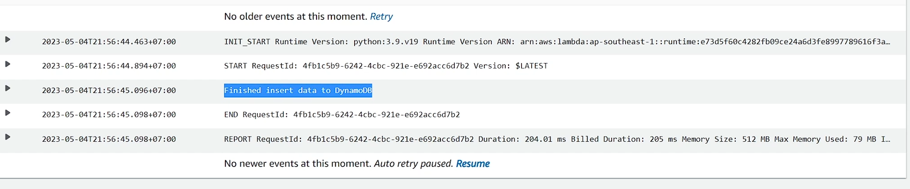

# What is Lambda?

- Một service serverless của AWS cho phép người dùng thực thi code mà không cần quan tâm tới hạ tầng phía sau.
- Lamda hỗ trợ các ngôn ngữ (runtime) sau:
  • Java
  • Python
  • .NET
  • GO
  • Ruby
  • Custom Runtime
  • Container

# Đặc trưng của Lambda

- Khi tạo 1 lambda function, bạn quyết định cấu hình thông qua thông số Memory. Min = 128MB, Max = 10GB. Memory càng cao, CPU được allocate càng lớn.
- Lambda khi khởi chạy được cấp phát 1 vùng nhớ tạm min = 512MB max =10GB, sẽ bị xoá khi lambda thực thi xong.
- Timeout tối đa 15 phút (quá thời gian này nếu execute chưa xong vẫn tính là failed và bị thu hồi resource).
- Lambda có thể được trigger từ nhiều nguồn: Trigger trực tiếp (Console or CLI), API Gateway, event từ các service khác `(S3, SQS, DynamoDB, Kinesis, IoT...), hoặc chạy theo lịch (trigger từ EventBridge).`

- Lambda có 2 mode chạy là chạy ngoài VPC và chạy trong VPC. Thông thường nếu lambda cần kết nối với RDS Database thì nên để trong VPC. \*Lưu ý đến số lượng IP của subnet chứa lambda.
- Lambda sau khi chạy xong sẽ không lưu lại bất cứ gì.
  o Log -> CloudWatch log
  o File output -> S3 hoặc EFS
  o Data output -> RDS Database hoặc DynamoDB.
- Lambda cũng cần được cấp IAM Role để có thể tương tác với các resource khác. Mặc định Lambda khi tạo ra sẽ được gán Role có các quyền cơ bản (vd write log to CloudWatch).

- Lambda không chỉ chứa 1 file code mà có thể chứa các file library, file common,... Để tiện dụng ta có thể gom nhóm chúng lại thành các layer và tái sử dụng ở nhiều function, tránh duplicate code.
- Khi có nhiều request từ client, Lambda scale horizontal bằng cách gia tăng số lượng concurent execute (Số lượng lambda chạy tạm thời). Giới hạn này mặc định khi tạo account AWS là 10 concurent executions. Cần request tăng số này lên trước khi release production.
- Lambda có thể được set một số reserve concurent để tránh bị ảnh hưởng bởi các lambda khác.
  ( bạn có thể đặt reserved concurrency cho Lambda A, ví dụ như 200 phiên bản. Điều này có nghĩa là Lambda A sẽ luôn có ít nhất 200 phiên bản sẵn sàng để chạy, bất kể Lambda B và Lambda C có đang dùng bao nhiêu.)
  (Giải thích chi tiết) [text](giải-thích-reserve-concurent.md)

# Lambda Pricing

- Lambda là một dịch vụ có idle cost = 0. Người dùng chỉ trả tiền cho chi phí chạy thực tế, cụ thể:
  • Thời gian execute của lambda. Đơn vị GB*second
  VD Singapore price: $0,0000167/GB*second
  • $0.2 / 1 millions requests
  VD: bạn có 1 lambda 512Mb memory, mỗi request chạy trong 5s, 1 tháng có 100,000 requests
  • 250,000 GB*second = $4.175 ( 5 x 100,000 x 0.5)
  • (250,000/1,000,000)*0.2 = $0.05
  Total: $4.225

# Hệ sinh thái Lambd

- Lambda là một service có thể liên kết với gần như tất cả các service khác của AWS, miễn là nó được cấp IAM Role phù hợp.
  

# Ưu điểm

• Không tốn effort cho quản trị hạ tầng, High Availablity.
• Zero idle cost. Do lambda chỉ phát sinh chi phí khi chạy, nếu hệ thống không phát sinh nhu cầu sử dụng -> cost gần như zero.
• Kết hợp được với nhiều service của AWS.
• Khả năng scale mạnh mẽ (bằng cách nhân bản số lượng concurrent).
• Support nhiều ngôn ngữ.
• Dễ dàng triển khai bằng nhiều tool do AWS phát hành hoặc 3rd party.

# Nhược điểm

• Cold start: Code cần thời gian để nạp lên memory trước khi thực sự bắt đầu chạy. \*Gần đây AWS đã cải thiện được vấn đề này rất nhiều.
(Do lambda không lưu bất kì trạng thái nào, khá với việc cài một aplication web server lên ec2 hoặc container nó luôn luôn chạy và chờ req từ client, thì lambda cần thời nạp code nên)
• Giới hạn về bộ nhớ: 10GB. Không phù hợp cho các tác vụ nặng.
• Khó tích hợp. Hệ thống để deploy lên lambda cần chia nhỏ do đó làm tăng tính phức tạp và khó debug.
• Giới hạn về thời gian chạy, max 15min. Không phù hợp với các tác vụ tính toán tốn thời gian
• Không lưu lại trạng thái sau khi chạy. Cần có external storage, database, logging.

# Khi nào nên sử dụng Lambda?

- Do những ưu điểm kể trên, Lambda phù hợp cho những usecase
  • Tác vụ automation trên AWS, nhận trigger từ các AWS service như S3, DynamoDB, SNS, SQS,...
  • Backend cho API hoặc IoT.
  • Xử lý data trong bài toán data ETL. ()
  • Hệ thống có kiến trúc microservice nói chung.
  • Công ty start up muốn tối ưu cost cho giai đoạn đầu.

# Khi nào KHÔNG nên sử dụng Lambda?

Do những hạn chế kể trên, Lambda Không phù hợp cho những usecase
• Hệ thống Monolithic (do souce code quá nặng) hoặc team không có kinh nghiệm phát triển hệ thống microservice.
• Xử lý dữ liệu lớn, phân tích, tổng hợp data (hoặc chạy nhiều hơn 15p).
• Machine Learning

# Các usecase thường sử dụng Lambda

## Dùng làm backend API khi kết hợp với API Gateway

(api gateway là dịch vụ chuyên giúp ta nhanh chóng xây dựng một api nhanh chóng, api gateway hộ trợ authen là authorizer lambda khi có thông tin user đẩy lên như là username passwrod thì lambda authorizer sẽ viết hàm custom để check login người dùng )


## Thực hiện các tác vụ đơn giản theo lịch kết hợp với EventBridge (bật tắt EC2 và nếu thành công notification SNS)


## Xử lý async khi nhận trigger từ S3

(Ví dụ ta có s3 chuyên upload tài liệu, hoặc những cái hình nên khi có ai upload ta muốn trigger sang lambda xử lý transform file hoặc save metadata trong RDS chẳng hạn)


## Xử lý async khi nhận trigger từ DynamoDB

(DynamoDB có data export streaming nó hỗ trợ stream data khi có sự thay đổi hoặc thêm mới, delete sang lamda, khi client tương tác với data thay đổi trên DynamoDB, tại sao lại vẽ DynamoDB đứng sau api gateway -> bởi vì nó kết hợp được, một số hệ thống ưu tiên lưu vô DynamoDB sau đó mới sử lý )
(Cho phép client lưu thẳng data vô DynamoDB sau đó DynamoDB mới trigger sang lambda và lambda sẽ sử lý, kết quả có thể lưu ở trong DynamoDB hoặc table khác, table data đã được sử lý)


## Sử dụng trong bài toán ETL khi kết hợp với Kinesis, IoT


# Lab Hello lambda

Tạo một lambda đơn giản trả về helloworld (python)
(lamda => create function => Author from scratch => name: hello-world-lambda => runtime python 3.9 => Role: create a new role => create)

(bên trái là trigger những gì có thể trigger tới lambda, bên phải là destination nghĩa là lambda có thể gọi sang gì đó, Layer là các module code (ví dụ: node_modules trong nodejs))
(file code ta có thể tạo nhiều file)
==> Chỉnh sửa gì xog phải deploy code

- tab test có thể tạo các event test để test các event trước khi gán thật (ví dụ ta muốn event từ s3 sang không biết là code ta có chạy hay không ta có thể tạo event test S3 Put)
  

- General configuration: config memory, Ephemeral storage (khi lambda chạy nó cần có một vùng nhớ tạm để lưu), timeout (tác vụ sử lý cao thì tăng lên)

- Triggers ta có thể add trigger resouce khác sang lambda
- Permision: ta có thể gán thêm role, cần tương tác vớ s3 thì gán role s3
- Environment variables: tham số nếu cùng một 1 code nhưng ở môi trường khác nhau sẽ chạy khác nhau
- VPC nếu như cần tương tác với database
- Concurrency: Unreserved account concurrency 10 -> đang mặc định là 10 Concurrent, nếu lambda này quan trọng ta có thể Reserve concurrency lên 20,30 để tránh bị tranh cái Concurrent bở các lamda khác

---

- Aliases: định danh để dễ gọi, thay vì gọi thông qua ARN

==> Test: vừa này có tạo test là hello-world, quay trở lại tab code bấm test chọn hello-world rồi bấm test

```python
import json

def lambda_handler(event, context):
    # TODO implement
    print("Hello! Iam viettu")
    return {
        'statusCode': 200,
        'body': json.dumps('Hello from Lambda!')
    }

```


- publish version: Action => publish new version => v1.0 => publish, Lưu ý: khi đã publish thì code không sửa được
- Có thể switch sang version khác: tab version => chọn version muốn switch

# Lab 1 – Xử lý file được upload lên S3 tự động

Yêu cầu: Tạo 1 lambda có chức năng xử lý hình (.jpg, .png) được upload lên S3 thành các size khác nhau, output được lưu vào thư mục tương ứng.
**Lưu ý:** Sourcce (trigger) và destination cùng một bucket luôn chỉ khác thư mục
Sơ đồ hệ thống:


```plaintext
serverless-lambda/resize-image-lambda.py
```

Steps:

1. Tạo một Lambda Layer (là thư viện sử dụng trong lambada chính) sử dụng zip file được cung cấp. \*Vì tác vụ xử lý ảnh đòi hỏi phải có một thư viện thêm vào.
   (lambad => layer => create layer => udemy-pillow-layer => Upload a .zip file => Runtime: Python 3.9 hoặc chọn nhiều hơn => x86_64 => create)
   **Lưu ý:**:` chọn nhiều runtime nhất có thể để runtime đó có thể phù hợp với layer muốn add ở lamda function`
2. Tạo một lambda python theo mẫu, add layer đã tạo ở step1.
   (lambda => create funtion => name: udemy-size-image-function => Runtime python 3.9 => create) => copy code vô
   (lambda => udemy-size-image-function => Layers => Add layer => custom layers => udemy-pillow-layer => version: 1 => add )
3. Cấu hình IAM Role cho lambda, add thêm policy S3FullAccess.
   (configuration => permision => bấm udemy-size-image-function-role-7upxntj1 => add permision => AmazonS3FullAccess => add)
4. Setting trigger từ S3 cho thư mục /images.
   ( s3 => bucket => properties => Event notification => create => name: image-upload-event => prefix: `/images` => suffix: .jpg => Event type: All object create event => Destination => lambda funtion => udemy-size-image-function => save change)
5. Thử upload một file định dạng .jpg (vào folder images)
   (nếu lỗi => memory ,timeout cho lamda funtion cao hơn )
6. Kiểm tra log của lambda.
   
7. Kiểm tra xem các file resized có được tạo ra và lưu vào thư mục tương ứng.
   

## Note for lambda layer

\*Trong bài Lab 1 có sử dụng lambda layer từ Github repository sau: https://github.com/keithrozario/Klayers

Có thể dùng arn [arn:aws:lambda:ap-southeast-1:770693421928:layer:Klayers-p39-pillow:1]

# Lab 2 – Bật tắt EC2 instance theo lịch

Ý tưởng: hạn chế tác vụ lặp đi lặp lại hàng ngày và không muốn tốn quá nhiều resource => có thể dùng lambda tính tiền theo số lượng chạy

Yêu cầu: Tạo 1 lambda có chức năng bật tắt EC2 instance theo lịch. Lambda nhận 2 tham số là “instance_id” và “action” (START, STOP). Tiến hành setting schedule cho lambda sử dụng EventBridge. Khi triger lambda, EventBridge sẽ truyền sang 2 tham số cần thiết.
Sơ đồ hệ thống:


- Steps:
  • Tạo một EC2 instance Linux.
  (ec2 => create => name: udemy-test-start-stop-ec2 => default hết => create)
  • Tạo một Lambda Function (python) với code mẫu.
  (lambda => function => create => name: udemy-start-stop-ec2-function => Runtime: python 3.9 => x86*64 => create)
  (funtion => Configuration => General configuration -> timeout: 10s => save)
  ([text](../auto-start-stop-ec2.py))
  • Cấp quyền EC2StartInstance/ EC2StopInstance cho Lambda.
  (funtion => Configuration => Permision => edit => add permission => create inline policy => server: ec2 => Action -> write -> AmazonEC2FullAccess, StopInstances => Resources: All => name: lambda-allow-start-stop-all-ec2-instance => create )
  • Setting một EventBridge event với lịch gần với thời gian hiện tại, trong event truyền tham số {action: STOP, instance_id: <instance id muốn stop>}
  (EventBridge => Schedules => create => name: Auto-stop-EC2-test => Schedule group: default => Schedule pattern -> Occurence: Recurring schedule -> schedule type: Cron-based-schedule -> cron: 03 (minitues) , 22 (hours), * (days), _ (month), ? (day of week), \* (year) -> flexible time: off => timezone: Bangkok => next => target API: frequenntly used apis -> chọn lamda -> lambda function: udemy-start-stop-ec2-function => input: { "instance_id": "i-08364cc10f525e95c", "action": "STOP"} => next => retry policy: disable retry (tắt đi) => next => create schedule )
  ( thời gian cron là đế đúng thời gian đó là EventBridge sẽ bắn sự kiện sang lamda)
  (10h3p sẽ strart ec2 được chỉ định với id đó lên)
  
  
  
  • Đợi đến thời gian đã set, xem lambda có được trigger, EC2 có được stop
  (kiểm tra vào coi log lamda, nếu trigger lỗi có thể chỉnh lại thời gian `Cron-based-schedule`)
  
  • Thực hiện tương tự cho hành động start instance. {action: START, instance_id: <instance id muốn start>}
  (EventBridge => Schedules => create => name: auto-start-EC2-test => Occrurrence: Recuring schedule => schedule type: cron-bases-schedule => cron: 11 (minutes), 22 (hours), _ (day), _ (month), ?(day of week), _ (year) => flexible time window: off => timezone: +7 Bankok => next => target api: frequency => aws lambda => udemy-start-stop-ec2-function => input: { "instance_id": "i-08364cc10f525e95c", "action": "START"} => next => retry policy: disable => next => create) (10h11p sẽ strart ec2 được chỉ định với id đó lên)
  

# Lab 3 – Xử lý data CSV lưu vào DynamoDB

Yêu cầu: Tạo 1 lambda có chức năng nhận notification từ S3 khi có một file csv được upload. Lambda đọc file csv và lưu vào DynamoDB table tương ứng.

Steps:

1. Tạo table employee trong DynamoDB như sample.
   
2. Tạo một file csv theo sample.
   [text](../employee.csv)
3. Tạo lambda sử dụng code mẫu
   (lamda => function => crate => name: udemy-csv-to-dynaomoDB-employee => runtime: python 3.9 => x86_64 => create funtion => copy code )
   [text](../s3-csv-to-dynamodb.py)
4. Config lại Memory và timeout (vd 512 MB, 2min)
   (lambda => configuration => general => edit => memory: 512MB, timeout: 2 minutes => save)
5. Cấu hình Lambda, cấp S3FullAccess & DynamoDBFullAccess permission
   (configuration => permision => bâm vô role => add permison => S3FullAccess, DynamoDBFullAccess)
6. Cấu hình trigger từ S3 sang Lambda
   (s3 => bucket => create folder employee_csv => properties => Event notification => create => employee_csv => prefix: employee_csv/ => suffix: .csv => event type: object creation: all object create event (s3:ObjectCreated\*) => destionation: lamdafuntion => udemy-csv-to-dynaomoDB-employee => save change)
7. Test upload một file csv lên S3.
   (vô folder employee_csv => upload file `employee.csv` => upload)
   
8. Xem Log của Lambda function.
   (lamda => monitor => View cloudwatch )
   
9. Xem kết quả data lưu vào DynamoDB Table
   

==> usecase: trong thực tế sử lý data thô dưới dạng csv , xử lý xong lưu vào database
