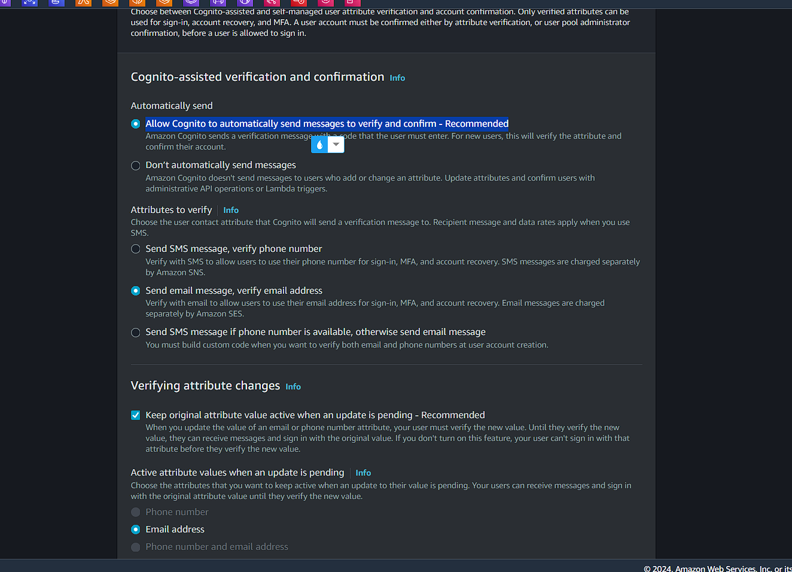
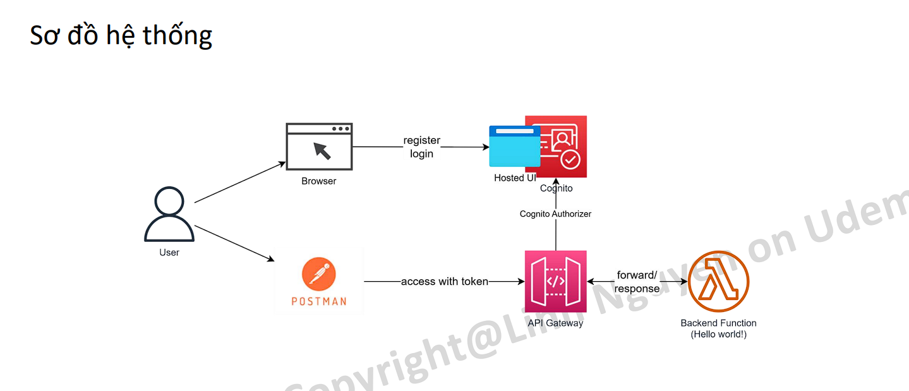

# API Gateway là gì?

- Một dịch vụ API Gateway được cung cấp bởi AWS. Nó cung cấp một cách đơn giản để xây dựng, quản lý và bảo mật các RESTful API hoặc `WebSocket`. AWS API Gateway là một dịch vụ quan trọng trong kiến trúc dựa trên các dịch vụ của AWS (AWS-based microservices architecture) và thường được sử dụng cùng với các dịch vụ AWS khác như AWS Lambda, EC2, S3, Amazon DynamoDB.

- AWS API Gateway cung cấp các tính năng:
  • Cho phép thiết kế và phát triển API RESTful hoặc WebSocket thông qua web GUI.
  • Điều phối các yêu cầu API đến các hệ thống hoặc dịch vụ khác nhau.
  • Authen/Author request tới các API.
  • Quản lý và giám sát các yêu cầu API, vd số lượng request, response time...
  • AWS API Gateway cũng cung cấp các tính năng bảo mật, bao gồm chứng thực và ủy quyền các yêu cầu API và mã hóa secure communication giữa các hệ thống khác nhau.

- Đặc trưng của API Gateway
  • Là một fully managed service của AWS. (chỉ sử dụng không có quản lý hạ tầng phái sau)
  • Khả năng scale và High Availablity không giới hạn.
  • Zero idle cost
  • Easy to setup
  • Dễ dàng kết hợp với các dịch vụ khác như CloudWatch, WAF cho mục đích monitor & security.

# Hệ sinh thái API Gateway

API Gateway là một service chủ yếu có nhiệm vụ nhận request của client sau đó forward tới các service phía sau.


# Khi nào nên sử dụng API Gateway?

- API Gateway phù hợp cho những bài toán sau:
  • Kiến trúc `Micro-service` sử dụng lambda làm backend (api gateway nhận request và điều phối chúng đến backend)
  • Backend API cho hầu hết các use case (web API, IoT)
  • Gateway nhận data trực tiếp từ client sau đó lưu vào DynamoDB (DB First)
  • `Web Socket` cho những hệ thống `realtime communication`.

# API Gateway Pricing

- API Gateway là một dịch vụ có idle cost = 0. Người dùng chỉ trả tiền cho chi phí chạy thực tế, cụ thể
- Với REST API:  
  • Số lượng request (Vd Singapore region:$ 4.25/1M requests)
  • Data transfer out ($/GB)
  • Caching size tính theo GB/hour
  Với Web socket
  • Message number (đối với Web socket). Vd $1.15/1M message với block 32KB.
  • Connection minutes: $0.288/1M connection minutes

# Authentication cho API Gateway

API Gateway cung cấp 2 phương thức authen tích hợp trực tiếp (authorizer) thường được sử dụng đó là:
• Cognito Authorizer
Liên kết trực tiếp với một Cognito User Pool sử dụng làm authorizer. Khi access API, client passing trực tiếp token lấy được thông qua login với Cognito, API Gateway sẽ check token và allow access nếu token hợp lệ.
• Lambda Authorizer (custom authorizer)
Khi sử dụng loại authorizer này, bạn sẽ tự implement logic authen trên Lambda (logic authen là ta tự implement). Có 2 hình thức là authen dựa vào TOKEN (JWT) hoặc request parameter based (VD username/password).

## Mô hình sử dụng Lambda làm authorizer

client gọi api gattway với token or paramater và api gateway sẽ call đến lamda để check xem có hợp lệ hay không, nếu hợp lệ thì về thông tin sẽ lưu trong cache của api gateway và caching một khoảng thời gian và các request tiếp thoe không phải authen qua lambda nữa, khi đã pass qua api gateway thì nó mới được forward xuống backend (ec2 or lambda)


# Lab 1 – API Gateway + lambda backend

Yêu cầu: Tạo 1 API Gateway có chức năng nhận request từ client, forward tới Lambda backend xử lý sau đó response.
Sơ đồ hệ thống:


Steps:

1. Tạo một Lambda function với code mẫu (Python)
   ( lambda => create function => author from scratch (tức là tôi tạo ra một cái rỗng rồi điền code vô sau) => name: udemy-test-caculate => runtime: python 3.9 => x86_64 => create => copy pate => deploy)
   [text](../simple-api-lambda.py)
2. Tạo một API Gateway
   (tạo api gateway với path /caculate)
   (api gateway => create api => rest api => build => new api => name: udemy-test-api => Endpoint type: Regional (scope trong region singapore, edge-optimal thì được đẩy lên các máy chủ cloudfront, private thì chọn vpc cho nó) => create api)
   (console api gateway => `resuouce`: chứa các path và intergrations với backend, `stage`: hiểu làm một khu vực độc lập về mặt logical, khi ta có code mới muốn triển khai trên các stage khác nhau (stage: dev, testing), `authorizers`: nới gán các authorzer, `gateway reponse`: ta có thể custom reponse trả về, `Model`: schema reponse, `Usage plan`: để control việc request,`Api key`: cách để ta có thể role test định kỳ tránh việc api bị khai thác (ví dụ ta có api endpoint cung cấp cho mobile nhưng ta không muốn bên thứ 3 lợi dụng api của mình thì ta có thể đưa api key vào, thì ta add thêm require vào api key) )
3. Tạo resource & path vd /calculate method POST, forward sang lambda
   (api gateway => create resouce => resouce path: / -> reouse name: caculate => bỏ qua CORS => create (chưa có method nào hết))
   (resouce => create method => method type: POST => intergration type: lambda function => Lambda proxy integration: disable (nó sẽ format thành json trước khi gửi đến lambda) => lambda function: ap-southaest-1, udemy-test-caculate => (có thể bật api key để bảo mật hơn) => create )
   
   
4. Deploy API Gateway thành một stage vd dev
   (để sử dụng được api gateway => Deploy api => Stage: _New stage_, Stage name: dev, Deployment description: v0.1 => deploy)
   (lưu ý edit xog phải deploy lại api)
5. Sử dụng Postman để test API
   [https://8pd5srspaf.execute-api.ap-southeast-1.amazonaws.com/dev/caculate]
   (import file [text](../calculator.postman_collection.json) vào postman)

```json
{
  "statusCode": 200,
  "body": "{\"message\": \"Request processed successfully\", \"result\": 35}",
  "headers": {
    "Content-Type": "application/json"
  }
}
```

# API Gateway advanced option

- Stage: giống môi trường triển khai, với mỗi lần cập nhật code thì triển khai trên stage dev trước và nếu test ok thì triển khai các stage tiếp theo
- Usage plan: giới hạn việc truy cập vô api gateway, không phải ai truy cập cũng được
  (Usage plan => name: dev-usage-plan => Rate: 100 (tổng số request/second mà tất cả client có thể call) => Burst: 10 (số lượng đồng thời user có thể truy cập đến api ở đây là giới hạn chỉ 10 người truy cập api cùng lúc) => Quota: 1000000 (giới hạn số lượng truy cập trong khoảng thời gian ngày or tháng, nếu bị hack đi nữa thì cũng bị chặn bởi con số này nên không tốn nhiều tiền))
- Api key: tránh việc bên thứ ba lợi dụng khi không có api key, khi request phải có api key mới request được
- Custom domain: sử dụng domain do Route 53 quản lý
  (api gateway => custom domain => create => Domain name: api.viettu.id.vn)

# Lab-API Key & Usage plan

Yêu cầu: Sử dụng lại API đã tạo ở bài lab trước
• Add Usage plan và API Key cho API
(Usage plan => name: dev-usage-plan => Rate: 100 => Burst: 10 => Quota: 1000000)
(API keys => create => Name: dev-api-key => Auto generate => save)
• Gán Usage plan & API key vào API Gateway, deploy lại lên stage dev.
(Usage plan apply ở cấp độ stage chứ không phải cấp độ api gateway)
(Usage plan => test-usage-plan => Associated api keys => add Api key => chọn "dev-api-key" => add api key)
(Usage plan => test-usage-plan => Associated stages => add api stages => API: udemy-test-api, stage: dev => Add to usage plan)
(kể từ thời điểm này api gateway cụ thể là stage dev chịu control của Usage plan (giới hạn) và api key )
(API => resouces => qua tab POST => Method request => Edit => tích API key require => save => Deploy api)
(Chú ý: khi assocated stage với api gateway cần deploy api lại)
`• Bổ sung x-api-key vào request header trong postman.`
`(không có api key sẽ reponse về status:403 và lỗi "Forbidden")`

```json
{
  "message": "Forbidden"
}
```

```plaintext
x-api-key: zv6u5w3wKY2rnpQjNZErZ25b3KukAyNO8vjbDUeN
```

• Call API từ postman -> kiểm tra kết quả.

==> Usage plan: giúp tránh việc hacker tấn công

# Giới thiệu Cognito

## Cognito là gì?

AWS Cognito là một dịch vụ quản lý danh tính và xác thực người dùng của Amazon Web Services (AWS). Dịch vụ này cho phép bạn tạo ra các ứng dụng web và di động an toàn với khả năng xác thực người dùng, phân quyền, và đăng nhập với nhiều tùy chọn như user account, Social login hoặc đăng nhập qua Identity Provider.

## Tính năng của Cognito

- Tính năng cơ bản của Cognito
  • Đăng ký & Xác thực người dùng sd username/pw/email hoặc tài khoản mạng xã hội.
  • Phân quyền người dùng vào các ứng dụng hoặc tài nguyên
  • Xác thực email/số điện thoại.
  • Tích hợp với các dịch vụ khác (API Gateway, Lambda) để xây dựng ứng dụng.
  • Hỗ trợ cho ứng dụng di động (iOS,Android) thông qua SDK
  • Cognito sync: sync data giữa các mobile device với nhau
  • Advanced Security: giám sát & phân tích truy cập của user để phát hiện và ngăn chặn truy cập bất thường (optional).

## Pricing của Cognito dựa trên

• Số lượng Monthly Active User. VD ở Singapore là $0.0055/MAU (càng lên cao càng rẻ)
• User sign in thông qua SAML hoặc OIDC: $0.015/MAU
• Tính năng Advance Security: $0.05/MAU nếu enable
• SMS trong trường hợp gửi message MFA: Tuỳ theo khu vực.

## Hạn chế của Cognito

• Số lượng User trên 1 user pool: 40M (contact AWS nếu muốn tăng)
• Số lượng user pool tối đa: default 1,000, max 10,000
• Custom attribute: 50 (name, age, date_of_birthday,...)

- Hạn chế về tần suất Admin API call vd:
  • UserCreation: 50 RPS. Tăng thêm 10RPS cho mỗi 1 triệu MAU
  • AdminUserRead: 120 RPS. Tăng thêm 40 RPS cho mỗi 1 triệu MAU
  • RevokeToken: 120 RPS. Tăng thêm 40 RPS cho mỗi 1 triệu MAU
  • UserUpdate: 25 RPS không thể tăng thêm

## Lưu ý về cơ chế verify token của Cognito

- JWT token do Cognito phát hành thông thường sẽ dùng client side verify (sử dụng Public Key do Cognito cung cấp. \*Lưu ý AWS không cung cấp private key của Cognito).
- Việc này đồng nghĩa với việc nếu user logout thì access-token vẫn có hiệu lực cho tới khi expired (vd 30 min).
- Nếu hệ thống có nhu cầu revoke access-token đã phát hành khi user có các hành động như change password, log-out thì không thể thực hiện với Cognito. Tất nhiên có thể workaround sử dụng các kỹ thuật Caching/DB.
  
  (client register/login gọi đến cognito, khi user access bới backend trong trường hợp này là api gateway sẽ liên kết với cognito về mặt danh nghĩa, bản chất api gateway không call sang cognito để check token và cả backend sẽ không call đến cognito để check token, backend có thể dùng public key của congnito user pool để xác thực token )

## Lab 2- Cognito basic operation

Yêu cầu
• Login to AWS -> Cognito
• Tạo một user pool với các thông tin cơ bản
(Cognito => user pool => sign-in options không thể change sau khi tạo user pool => Self-registration: có cho phép tự đăng ký không => Use the Cognito Hosted UI: website login => app client: dùng để đăng ký user)





==> Create user pool
• Username, cho phép dùng email đã verify làm username
• Cho phép tuỳ chọn username (user có thể change)
• Tạo thử một user


• Tạo thử một group, gán user vào group


• Add user vô group vip (1 user có thể thuộc nhiều group, thông tin này khi login xog sẽ phản ánh access toekn, backend sẽ check xem user thuộc group nào và resouce tương ứng backend)


# Lab 3- Sử dụng Cognito Hosted UI

## sơ đồ hệ thống



(giao diện login, singup, forget password mà không phải host một web, code app client)

• Tạo một App Client (nếu chưa tạo). \*Chú ý bật `Implicit grant` (để phát hành dưới dạng token, không thì chỉ có code thôi và cầm code đó đi quy đổi token)
(User pool => App intergration => App client list => crete => type: Public client => name: udemy-app-01 => Client secret: Don't generate a client secret (đơn giản hóa việc login, nếu có secret phải chọn cả 2 thứ app-id và app-secret nữa) => Authentication flows: ALLOW_CUSTOM_AUTH (Lambda trigger based custom authentication), ALLOW_USER_PASSWORD_AUTH (User name and password authentication), ALLOW_USER_SRP_AUTH (SRP (secure remote password) protocol based authentication) => Refresh token expiration: 30 ngày => Access token expiration => Access token expiration (khi login sẽ trả về 2 thứ access token và refresh token) => callback: https://google.com => Identity providers: Cognito user pool => OAuth 2.0 grant types: `Implicit grant` (Specifies that the client should get the access token (and, optionally, ID token, based on scopes) directly),Authorization code grant => Attribute read and write permissions: tôi login xog có quyền đọc/ghi những attribute nào => create)


• Cấu hình Hosted UI của Cognito User pool.
https://udemy-vettu-test-pool-01.auth.ap-southeast-1.amazoncognito.com/authorize?client_id=7i7b1knccari3jt84qmtoi1i0m&response_type=token&scope=openid&redirect_uri=https://google.com

==> Khi đăng nhập thành công
id_token=eyJraWQiOiJmMUpkNUFtQ0ZBeDlMNnVsTnBMRmFrd2d2bFQ4bGdSN3NxUnJQWUU4MU5NPSIsImFsZyI6IlJTMjU2In0.eyJhdF9oYXNoIjoiVWFaRC1NenY5Y1B6czRzYmVhRkdOdyIsInN1YiI6IjE5NmE0NTBjLTYwYTEtNzBjMS00MzllLTM3ZjNiNDlhNDhiOCIsImNvZ25pdG86Z3JvdXBzIjpbIm1lbWJlcl92aXAiXSwiaXNzIjoiaHR0cHM6XC9cL2NvZ25pdG8taWRwLmFwLXNvdXRoZWFzdC0xLmFtYXpvbmF3cy5jb21cL2FwLXNvdXRoZWFzdC0xX3pBd1FaaHNKTiIsImNvZ25pdG86dXNlcm5hbWUiOiJ2aWV0dHVfdWRlbXkiLCJhdWQiOiI3aTdiMWtuY2NhcmkzanQ4NHFtdG9pMWkwbSIsImV2ZW50X2lkIjoiMjY1MTZlYjAtYzkzMy00YmU1LWFiNDAtMzkwYmRhZGMxNWZhIiwidG9rZW5fdXNlIjoiaWQiLCJhdXRoX3RpbWUiOjE3MjQ0MTgwNDIsImV4cCI6MTcyNDQyMTY0MiwiaWF0IjoxNzI0NDE4MDQyLCJqdGkiOiI3OGMyZTMyNS1jYTM1LTRjNGUtYjVkZS00NWY2MjQ5ZjVkODIiLCJlbWFpbCI6ImxsNjAxMjA2NUBnbWFpbC5jb20ifQ.n2X2kL8yhGt2NHqzXg8rN1aHJ7zJYe3af1f2QF-49cyI5uqJgxpLD9fSM2XQUnhw6y3zM8s0iYg6LoqexLqAtEKQ2_tDu1DgGGws3HIXJKjjwerLds2GK-iwaGxtTTxT1oF00f5DyjDyZK3TuHnqueSAU8Jf-L8jT5mxR7li86Bjqj9oyscZbN_sOkJPyEMaCQ6TPYPuIotAhRyqR6f7N7obr1_bERbbgc4mk0w9RrrL-U_6PPEF92YTCspDRTznCP28sUcOZK7lkJHYTAnPt0XAzlOvpIck5wBK-62rllF1kuqXMjj6v_qjPoXTRPk8uFrUA84BWcbGpzahM7GNzQ

access_token=eyJraWQiOiJKc0ZmTDBCcFlNWFwvbjhwa3E0b3BJVndHdVFPcUxmdnJuTFJKTmNtY2NsVT0iLCJhbGciOiJSUzI1NiJ9.eyJzdWIiOiIxOTZhNDUwYy02MGExLTcwYzEtNDM5ZS0zN2YzYjQ5YTQ4YjgiLCJjb2duaXRvOmdyb3VwcyI6WyJtZW1iZXJfdmlwIl0sImlzcyI6Imh0dHBzOlwvXC9jb2duaXRvLWlkcC5hcC1zb3V0aGVhc3QtMS5hbWF6b25hd3MuY29tXC9hcC1zb3V0aGVhc3QtMV96QXdRWmhzSk4iLCJ2ZXJzaW9uIjoyLCJjbGllbnRfaWQiOiI3aTdiMWtuY2NhcmkzanQ4NHFtdG9pMWkwbSIsImV2ZW50X2lkIjoiMjY1MTZlYjAtYzkzMy00YmU1LWFiNDAtMzkwYmRhZGMxNWZhIiwidG9rZW5fdXNlIjoiYWNjZXNzIiwic2NvcGUiOiJvcGVuaWQiLCJhdXRoX3RpbWUiOjE3MjQ0MTgwNDIsImV4cCI6MTcyNDQyMTY0MiwiaWF0IjoxNzI0NDE4MDQyLCJqdGkiOiJlYzYyODA3NC1hYTZhLTRhNmEtYmFhMS01N2M1ODVjMzkzYTEiLCJ1c2VybmFtZSI6InZpZXR0dV91ZGVteSJ9.R1xPG4D4Xbws69CO-wEI3eLKnTHKmugdSYM4k2TIN9vDyIMb8NYTfIUJEW-BWra6JnrlvU8o43Qs_6-DD1dbioVHkr2K8ZoDRADfqY4a9wjCfS6ZfAPwPzReF8b3MqFZZA5qZjOYHmof-xydMmXa0yfeqpKDvtBw_8ybybb8T0hHI3RlV8SJVRFMVC4w9wexniMyKTXG12Av_cWN7QuKa455v1I_7bM0sZaZyafQRPmIp17YI491ZYcGBbC5GytxaEGv0XLOuAzGHTf99y4D19_hC3pTXdXyBn8NGCVL0V4EaLsLgaCrU788drbKGJjyKlhAWNlkAZ9EzgJ3wwTW9A

expires_in=3600
token_type=Bearer

• Sử dụng Hosted UI để tiến hành Login, Lấy access token
==> Khi đăng nhập thành công
(token: dạng jwt)
https://www.google.com/#id_token=eyJraWQiOiJmMUpkNUFtQ0ZBeDlMNnVsTnBMRmFrd2d2bFQ4bGdSN3NxUnJQWUU4MU5NPSIsImFsZyI6IlJTMjU2In0&expires_in=3600&token_type=Bearer
• Sử dụng JWT Tool để decrypt token xem bên trong có gì.

```json
{
  "at_hash": "FfQlt38FznwQ7OncGchg1Q",
  "sub": "196a450c-60a1-70c1-439e-37f3b49a48b8",
  "cognito:groups": ["member_vip"],
  "iss": "https://cognito-idp.ap-southeast-1.amazonaws.com/ap-southeast-1_zAwQZhsJN",
  "cognito:username": "viettu_udemy",
  "aud": "7i7b1knccari3jt84qmtoi1i0m",
  "event_id": "a9ccab9d-1d8d-4d5a-8987-b9f361feecae",
  "token_use": "id",
  "auth_time": 1724415126,
  "exp": 1724418726,
  "iat": 1724415126,
  "jti": "c1bf7eb3-bbc4-4fd4-9cd1-55f51b6ffb60",
  "email": "ll6012065@gmail.com"
}
```

==> Ta có thể dùng public key để verify token và không call lại cognito để hỏi xem token này có hợp lệ hay không

# Lab 4- Combine Cognito with API Gateway

Yêu cầu đã có một API Gateway chạy được với method đơn giản
• Cấu hình Authorizer cho API Gateway sử dụng Cognito user pool đã tạo
(api gateway => authorizor => create authorizor => name: cognito-authozier => Authorizer type: Cognito (nếu type lambda thì phải tạo lambda function handler auth) => Cognito user pool: udemy-test-user-pool-01 => Token source: `Authorization` => create)

(api gateway => resoucces => POST => Method request settings => edit => Authorization: cognito-authozier => save => Deploy API)


• Sử dụng hosted UI (Lab3) để login và lấy token.
• Thử truy cập API mà không có token -> Access Denied
khi test api ở postman

```json
{
  "message": "Unauthorized"
}
```

• Thử truy cập API có token lấy được từ step trước -> Allow.

- Add thêm hader
  **Đặc biệt lưu ý:**: là chỉ copy `id_token` thôi, chứ không copy hết cả access_token

```plaintext
id_token=eyJraWQiOiJmMUpkNUFtQ0ZBeDlMNnVsTnBMRmFrd2d2bFQ4bGdSN3NxUnJQWUU4MU5NPSIsImFsZyI6IlJTMjU2In0.eyJhdF9oYXNoIjoiVWFaRC1NenY5Y1B6czRzYmVhRkdOdyIsInN1YiI6IjE5NmE0NTBjLTYwYTEtNzBjMS00MzllLTM3ZjNiNDlhNDhiOCIsImNvZ25pdG86Z3JvdXBzIjpbIm1lbWJlcl92aXAiXSwiaXNzIjoiaHR0cHM6XC9cL2NvZ25pdG8taWRwLmFwLXNvdXRoZWFzdC0xLmFtYXpvbmF3cy5jb21cL2FwLXNvdXRoZWFzdC0xX3pBd1FaaHNKTiIsImNvZ25pdG86dXNlcm5hbWUiOiJ2aWV0dHVfdWRlbXkiLCJhdWQiOiI3aTdiMWtuY2NhcmkzanQ4NHFtdG9pMWkwbSIsImV2ZW50X2lkIjoiMjY1MTZlYjAtYzkzMy00YmU1LWFiNDAtMzkwYmRhZGMxNWZhIiwidG9rZW5fdXNlIjoiaWQiLCJhdXRoX3RpbWUiOjE3MjQ0MTgwNDIsImV4cCI6MTcyNDQyMTY0MiwiaWF0IjoxNzI0NDE4MDQyLCJqdGkiOiI3OGMyZTMyNS1jYTM1LTRjNGUtYjVkZS00NWY2MjQ5ZjVkODIiLCJlbWFpbCI6ImxsNjAxMjA2NUBnbWFpbC5jb20ifQ.n2X2kL8yhGt2NHqzXg8rN1aHJ7zJYe3af1f2QF-49cyI5uqJgxpLD9fSM2XQUnhw6y3zM8s0iYg6LoqexLqAtEKQ2_tDu1DgGGws3HIXJKjjwerLds2GK-iwaGxtTTxT1oF00f5DyjDyZK3TuHnqueSAU8Jf-L8jT5mxR7li86Bjqj9oyscZbN_sOkJPyEMaCQ6TPYPuIotAhRyqR6f7N7obr1_bERbbgc4mk0w9RrrL-U_6PPEF92YTCspDRTznCP28sUcOZK7lkJHYTAnPt0XAzlOvpIck5wBK-62rllF1kuqXMjj6v_qjPoXTRPk8uFrUA84BWcbGpzahM7GNzQ
```

```plaintext
Authorization: Bearer {{token}} ## id_token not access_token
```


===> lúc login không tương tác gì với api gateway hết, tương tác độc lập với cognito thông qua hosted ui, mobile thì dùng sdk, sau khi authen với cognito thì có token, từ các access tiếp theo ta sẽ access với token đó với header `Authorization`, api gatway sẽ gọi sang cognito để check xem hợp lệ không nếu hợp lệ thì forward xuống backend
